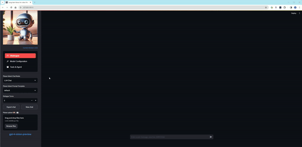
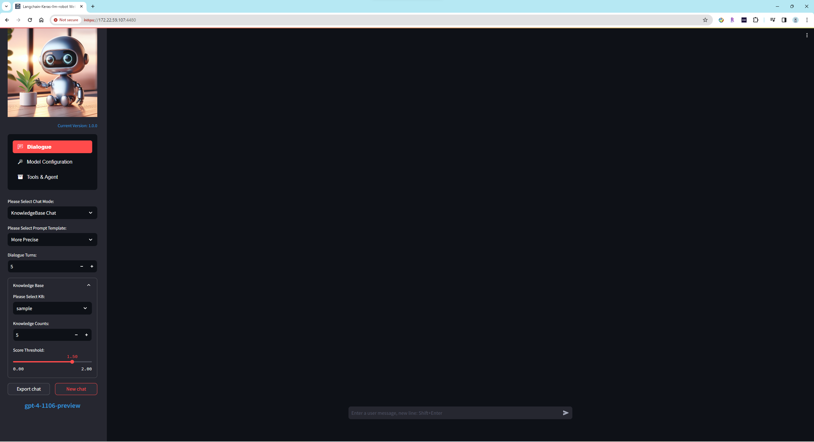
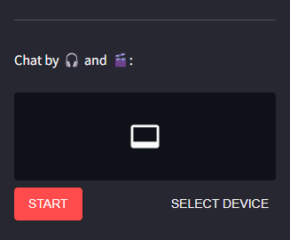
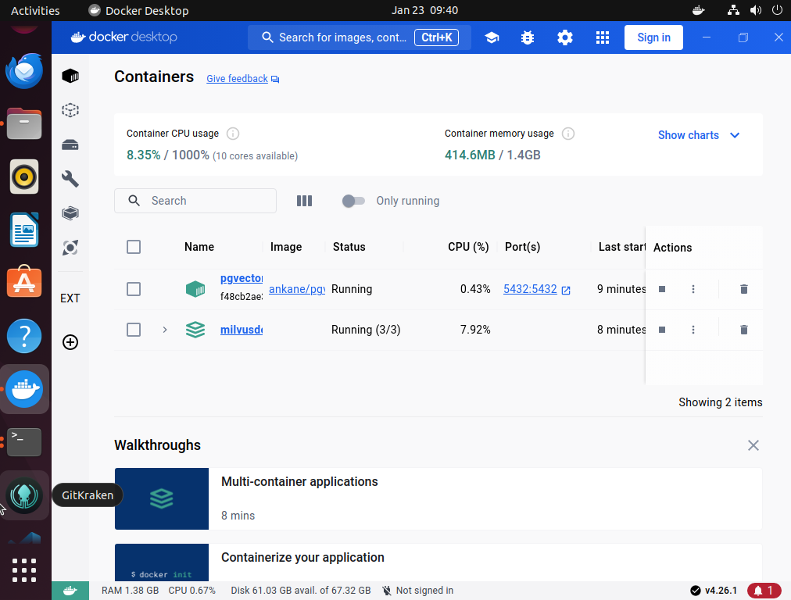
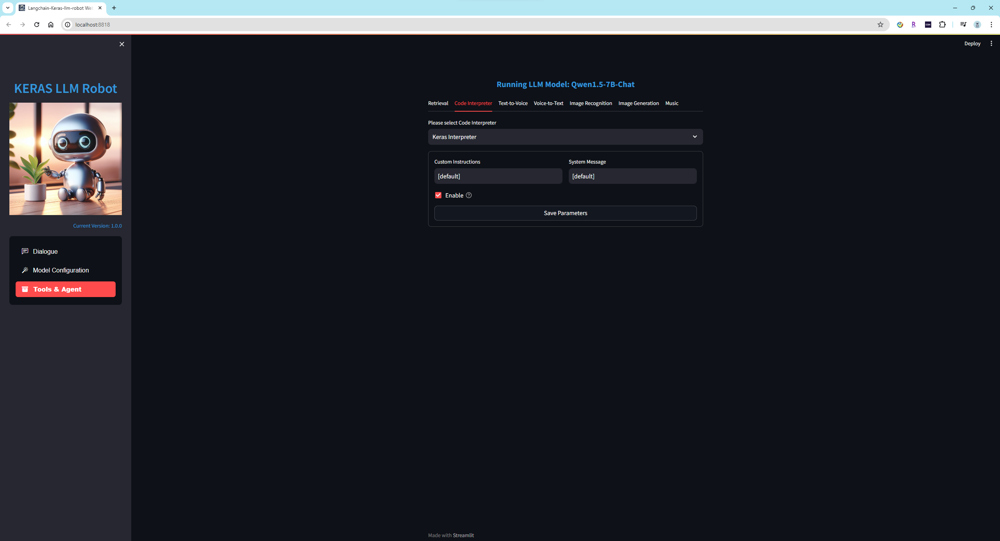
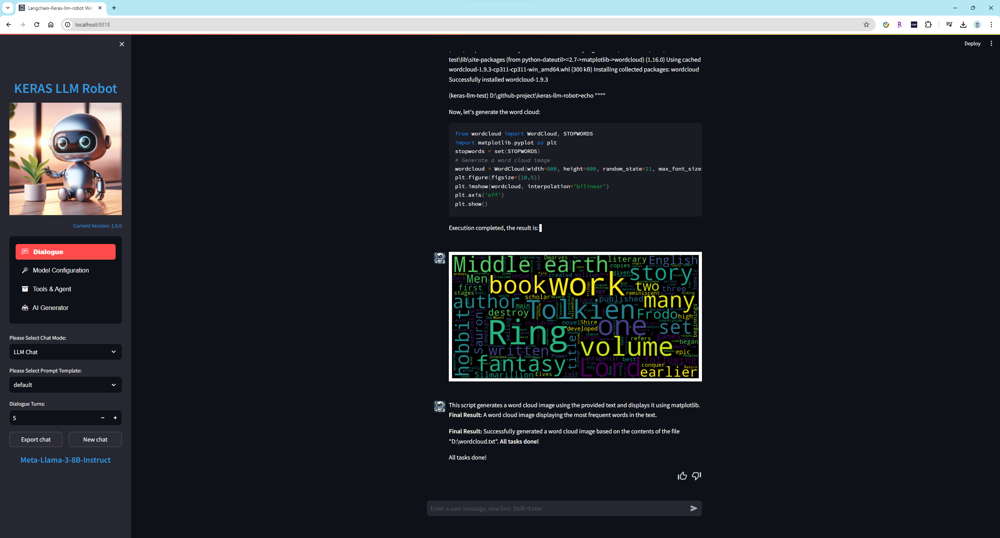
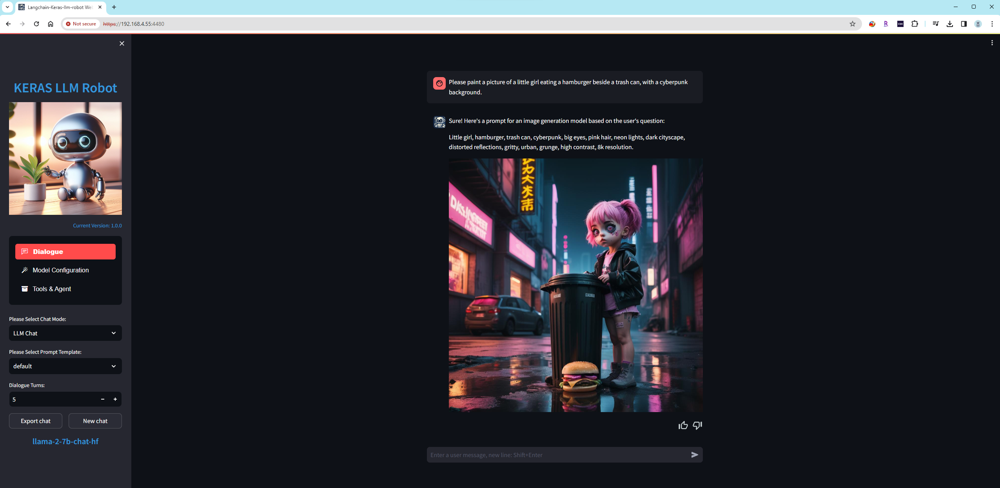
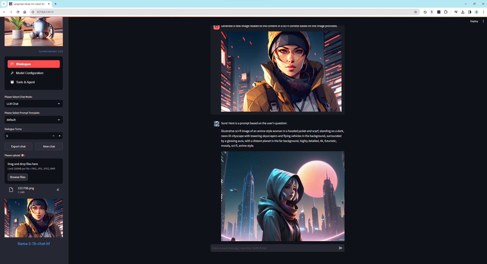

# Keras-llm-robot Web UI

🌍 [READ THIS IN ENGLISH](readme.md)

这个项目基础代码继承自 Langchain-Chatchat项目(https://github.com/chatchat-space/Langchain-Chatchat) 底层架构使用Langchain和Fastchat等开源框架，顶层使用streamlit实现。本项目完全开源，目标是可离线部署和测试Huggingface网站上的大部分开源模型，并且可以通过配置将多个模型组合起来，实现多模态，RAG，Agent等功能。项目支持Ubuntu, MacOS和Windows平台。



---

## 目录
* [快速启动](readme-cn.md#快速启动)
* [视频演示](readme-cn.md#视频演示)
* [项目介绍](readme-cn.md#项目介绍)
* [环境配置](readme-cn.md#环境配置)
* [功能介绍](readme-cn.md#功能介绍)
    * [界面介绍](readme-cn.md#界面介绍)
    * [语言模型的功能](readme-cn.md#语言模型的功能)
      * [1. 加载模型](readme-cn.md#1-加载语言模型)
      * [2. 模型量化](readme-cn.md#2-模型量化)
      * [3. 模型微调](readme-cn.md#3-模型微调)
      * [4. 角色扮演](readme-cn.md#4-角色扮演)
    * [辅助模型的功能](readme-cn.md#辅助模型的功能)
      * [1. 知识库检索](readme-cn.md#1-知识库检索)
      * [2. 代码解释器](readme-cn.md#2-代码解释器)
      * [3. 语音识别模型](readme-cn.md#3-语音识别模型)
      * [4. 图像识别模型](readme-cn.md#4-图像识别模型)
      * [5. 网络检索](readme-cn.md#5-网络检索)
      * [6. 函数定义](readme-cn.md#6-函数定义)
      * [7. 工具箱](readme-cn.md#7-工具箱)
    * [AI创造者](readme-cn.md#AI创造者功能)
      * [1. 智能客服代理](readme-cn.md#1-智能客服代理)
      * [2. 实时语言翻译代理](readme-cn.md#2-实时语言翻译代理)
      * [3. 虚拟私人助理](readme-cn.md#3-虚拟私人助理)


## 快速启动
  
  在启动之前请先准备好运行环境，请参考 [环境配置](readme-cn.md#环境配置)

  如果仅在本地进行部署，可以使用python启动WebUI，使用http接口 http://127.0.0.1:8818
  ```bash
  python __webgui_server__.py --webui
  ```

  如果需要在云服务器上部署，并在本地访问WebUI，请使用反向代理，并以HTTPS协议启动WebUI。在本地请使用 https://127.0.0.1:4480 打开WebUI，在远端使用https接口 https://[server ip]:4480 打开WebUI。
  ```bash
  // 批处理内部默认使用的虚拟环境是 keras-llm-robot，如果想使用其它的虚拟环境名称，请自行修改批处理文件
  // windows平台
  webui-startup-windows.bat
  
  // ubuntu(linux)平台
  python __webgui_server__.py --webui
  chmod +x ./tools/ssl-proxy-linux
  ./tools/ssl-proxy-linux -from 0.0.0.0:4480 -to 127.0.0.1:8818

  // MacOS平台
  python __webgui_server__.py --webui
  chmod +x ./tools/ssl-proxy-darwin
  ./tools/ssl-proxy-darwin -from 0.0.0.0:4480 -to 127.0.0.1:8818
  ```

  以Ubuntu为例, 你可以通过启动反向代理ssl-proxy-darwin，并在同一局域网内的其它设备上访问服务器:

  
  
  在Ubuntu上启动服务器

  
  
  在Ubuntu上启动反向代理

  
  
  在windows机器上，通过Https服务访问服务器


## 项目介绍
由三个主界面组成，语言模型的聊天界面，语言模型的配置界面，辅助模型的工具和代理界面。

聊天界面如下图：

语言模型是基础模型，当它被加载之后就可以使用聊天模式。语言模型也是多模态特性中的大脑。辅助模型当中的语音，图像和向量等模型，它们的输入或者输出数据都需要语言模型来处理。语音模型可以为语言模型提供耳朵和嘴的功能，图像模型可以提供眼睛的功能，而向量模型则提供了长期记忆的功能。目前本项目支持几十种语言模型。

配置界面如下图：

可以按照需求加载你需要的语言模型，语言模型分为通用模型，多模态模型，特殊模型和在线模型。

工具和代理界面如下图：

可以按照需求加载你需要的辅助模型，辅助模型按照功能分为向量检索模型，代码执行模型，文本转语音模型，语音转文本模型，图像识别模型，图像生成模型。工具中还包括功能调用的设置(需要语言模型支持Function Calling功能)。

## 环境配置

  1. 自行安装anaconda或miniconda，以及git。windows用户还需要安装CMake工具，ubuntu用户请安装gcc
  ```bash
  // 在Ubuntu干净环境下，请按照一下流程预安装数据包:
  // install gcc
    sudo apt update
    sudo apt install build-essential

  // install for ffmpeg
    sudo apt install ffmpeg

  // install for pyaudio
    sudo apt-get install portaudio19-dev

  // requestment默认安装faiss-cpu版，如果需要安装faiss-gpu版
    pip3 install faiss-gpu
  ```

  2. 使用conda创建虚拟环境keras-llm-robot并安装python, python请使用3.10 或者 3.11的版本
  ```bash
  conda create -n keras-llm-robot python==3.11.5
  ```

  3. 拉取仓库
  ```bash
  git clone https://github.com/smalltong02/keras-llm-robot.git
  cd keras-llm-robot
  ```

  4. 激活虚拟环境
  ```bash
  conda activate keras-llm-robot
  ```

  5. 如果拥有NVIDIA GPU，请首先安装CUDA Toolkit (https://developer.nvidia.com/cuda-toolkit-archive) ，并在虚拟环境中安装pytorch CUDA版本 (版本号请和CUDA Toolkit版本相同 https://pytorch.org/)
  ```bash
  // 例如安装12.1版本
  conda install pytorch=2.1.2 torchvision=0.16.2 torchaudio=2.1.2 pytorch-cuda=12.1 -c pytorch -c nvidia
  ```

  6. 安装依赖项, 请按照不同平台选择适当的requirements
  ```bash
  // windows平台, 安装过程中如果遇到llama-cpp-python和tts的编译错误，请将这两个安装包从requirements中删除掉，但是删除这2个包之后，将失去
  // 无法加载本地语音模型XTTS-2以及无法加载GGUF的量化模型。
  pip install -r requirements-windows.txt
  // Ubuntu平台
  pip install -r requirements-ubuntu.txt
  // MacOS平台
  pip install -r requirements-macos.txt
  ```

  7. 如果需要支持语音功能，还需要安装ffmpeg工具
  
    // windows平台

    下载ffmpeg的windows binrary包 (https://www.gyan.dev/ffmpeg/builds/).
    
    添加bin目录到系统的PATH环境变量中

    // ubuntu平台，安装 pyaudio
    sudo apt install ffmpeg
    sudo apt-get install portaudio19-dev

    // MacOS平台
    ```bash
    # libav
    brew install libav

    ####    OR    #####

    # ffmpeg
    brew install ffmpeg
    ```

  8.  如果需要从Huggingface上下载模型到本地离线运行，请自行下载模型之后，放入到"models"目录中。如果没有提前下载模型，程序会自动从Huggingface网站上下载到本地的系统缓存中。
  ```bash
  // 比如llama-2-7b-chat语言模型的目录是
  models\llm\Llama-2-7b-chat-hf

  // 比如XTTS-v2文本转语音的辅助模型目录是
  models\voices\XTTS-v2

  // 比如faster-whisper-large-v3语音转文本的辅助模型目录是
  models\voices\faster-whisper-large-v3
  ```

  9. 在使用`OpenDalleV1.1`模型生成图片时，如果使用16位精度使用模型，请先从Huggingface上下载`sdxl-vae-fp16-fix`模型并放入`models\imagegeneration`文件夹中。 如果开启Refiner，请先从Huggingface上下载`stable-diffusion-xl-refiner-1.0`模型并放入`models\imagegeneration`文件夹中。  

  10. 在使用`stable-video-diffusion-img2vid`或者`stable-video-diffusion-img2vid-xt`模型生成视频时：

        需要先安装ffmpeg和对应的依赖包：

        ```bash
        1. download generative-models from https://github.com/Stability-AI/generative-models in project root folder.
        2. cd generative-models & pip install .
        3. pip install pytorch-lightning
          pip install kornia
          pip install open_clip_torch
        ```

  11. 一些模型的加载，以及微调和量化功能需要`flash-attn`和`bitsandbytes`库，请使用如下方法安装。
  
      ```bash
      # Linux版本安装命令，需要大约1小时编译安装时间。
      pip install flash-attn
      pip install bitsandbytes

      # Windows版本下载URL，请选择正确的CUDA Tookit版本，Torch版本和Python版本。
      https://github.com/bdashore3/flash-attention/releases
      https://github.com/jllllll/bitsandbytes-windows-webui/releases
      # 下载后请使用以下命令安装
      pip install *.whl

      # MacOS版本不支持
      ```

  12.    如果仅想在本地进行部署，可以使用python启动WebUI，http://127.0.0.1:8818
  
      ```bash
      python __webgui_server__.py --webui
      ```

  13.    如果需要在云服务器上部署，并在本地访问WebUI，请使用反向代理，并以HTTPS协议启动WebUI。在本地请使用https://127.0.0.1:4480 打开WebUI，在远端使用 https://[server ip]:4480 打开WebUI。
  
      ```bash
      // 批处理内部默认使用的虚拟环境是 keras-llm-robot，如果想使用其它的虚拟环境名称，请自行修改批处理文件
      webui-startup-windows.bat
      
      // ubuntu(linux)平台
      python __webgui_server__.py --webui
      chmod +x ./tools/ssl-proxy-linux
      ./tools/ssl-proxy-linux -from 0.0.0.0:4480 -to 127.0.0.1:8818

      // MacOS平台
      python __webgui_server__.py --webui
      chmod +x ./tools/ssl-proxy-darwin
      ./tools/ssl-proxy-darwin -from 0.0.0.0:4480 -to 127.0.0.1:8818
      ```

## 功能介绍

### 界面介绍

- #### 配置界面

    在配置界面中，可以选择合适的语言模型加载，语言模型分为`基础模型`，`多模态模型`，`特殊模型`和`在线模型`

  1. **`基础模型`** Huggingface上发布的未经量化和处理过的模型，并且它们需要支持和OpenAI相同聊天模版的模型
  2. **`多模态模型`** 在底层支持语音和文本，或者图片和文本的模型
  3. **`代码模型`** 专业的代码生成模型
  4. **`特殊模型`** Huggingface上发布的量化模型(GGUF)或者需要特殊聊天模版的模型
  5. **`在线模型`** 支持OpenAI和Google的在线语言模型，比如GPT4-Turbo和Gemini-Pro模型，或者在线的多模态模型GPT4-vision和Gemini-Pro-vision。需要提供OpenAI的API Key和Google API Key。可以在系统环境变量中配置OPENAI_API_KEY和GOOGLE_API_KEY，或者在配置界面中单独配置。

  `目前参数可以配置加载设备和加载位数，模型量化功能还未实现`


- #### 工具和代理界面

  在工具和代理界面中，可以加载辅助模型比如向量检索模型，代码执行模型，文本转语音模型，语音转文本模型，图像识别模型，图像生成模型，或者配置功能调用

  1. **`向量检索模型`** 支持本地和在线向量数据库，支持本地和在线向量模型，并且支持多种文档类型。可以为基础模型提供长期记忆力。
  2. **`代码执行模型`** 支持本地的代码解释器Keras-llm-interpreter。
  3. **`文本转语音模型`** 支持本地模型XTTS-v2，支持Azure在线文本转语音服务，需要提供Azure的API Key。也可以在系统环境变量中配置SPEECH_KEY和SPEECH_REGION，或者在配置界面中单独配置。
  4. **`语音转文本模型`** 支持本地模型whisper，fast-whisper，支持Azure在线语音转文本服务，需要提供Azure的API Key。也可以在系统环境变量中配置SPEECH_KEY和SPEECH_REGION，或者在配置界面中单独配置。
  5. **`图像识别模型`** 支持本地模型blip-image-captioning-large。
  6. **`图像生成模型`** 支持本地模型OpenDalleV1.1进行静态图片的生成，支持本地模型stable-video-diffusion-img2vid-xt进行动态图片的生成。
  7. **`功能调用`** 可以配置功能调用，为模型加上使用工具的能力。


  当语音转文本模型加载之后，在聊天界面中将会出现语音和视频聊天控件，点击`START`按钮开始通过麦克风录制语音，点击`STOP`按钮结束语音，语音模型将会自动把语音转换成文本之后和语言模型进行对话。当文本转语音模型加载之后，语言模型输出的文本会自动转换成语音并通过扬声器或耳机输出




  当多模态模型加载之后(比如Gemini-Pro-Vision)，在聊天界面中会出现上传图像和文件控件，对于上传文件的限制则根据加载的模型而定。当在聊天窗口发送文字之后，将会把上传文件和文字传送给多模态模型处理。


- ### 语言模型的功能

  1. **`加载模型`**
      
      基础模型可以使用CPU或者GPU加载，以及使用8 bits加载(`4 bits加载无效`)，当使用CPU推理输出的时候，请设置合适的CPU Threads以提高Token输出速度。当加载GPTQ模型遇到错误“Using Exllama backend requires all the modules to be on GPU.”，请在模型config.json的"quantization_config"中添加"disable_exllama": true
      
      多模态模型可以使用CPU或者GPU加载，Vision模型加载后，用户可以上传图片和文字与模型对话。Voice模型加载后，用户可以通过麦克风(无需通过辅助模型)和模型对话。`该功能还未实现`

      特殊模型可以使用CPU或者GPU加载，GGUF模型优先使用CPU设备加载。

      在线模型无需占用额外的本地资源，当前支持OpenAI和Google的在线语言模型

      ---

      **`请注意`** 当TTS库未安装，将无法加载XTTS-2本地语音模型，但仍然可以使用其它在线语音服务；llama-cpp-python库未安装，将无法加载GGUF模型；没有GPU设备，将无法加载AWQ和GPTQ模型。对于

      | 支持模型 | 类型 | 大小 |
      | :---- | :---- | :---- |
      | fastchat-t5-3b-v1.0 | LLM Model | 3B |
      | llama-2-7b-hf | LLM Model | 7B |
      | llama-2-7b-chat-hf | LLM Model | 7B |
      | chatglm2-6b | LLM Model | 7B |
      | chatglm2-6b-32k | LLM Model | 7B |
      | chatglm3-6b | LLM Model | 7B |
      | tigerbot-7b-chat | LLM Model | 7B |
      | openchat_3.5 | LLM Model | 7B |
      | Qwen-7B-Chat-Int4 | LLM Model | 7B |
      | fuyu-8b | LLM Model | 7B |
      | Yi-6B-Chat-4bits | LLM Model | 7B |
      | neural-chat-7b-v3-1 | LLM Model | 7B |
      | Mistral-7B-Instruct-v0.2 | LLM Model | 7B |
      | llama-2-13b-hf | LLM Model | 13B |
      | llama-2-13b-chat-hf | LLM Model | 13B |
      | tigerbot-13b-chat | LLM Model | 13B |
      | Qwen-14B-Chat | LLM Model | 13B |
      | Qwen-14B-Chat-Int4 | LLM Model | 13B |
      | Yi-34B-Chat-4bits | LLM Model | 34B |
      | llama-2-70b-hf | LLM Model | 70B |
      | llama-2-70b-chat-hf | LLM Model | 70B |
      | cogvlm-chat-hf | Multimodal Model (image) | 7B |
      | Qwen-VL-Chat | Multimodal Model (image) | 7B |
      | Qwen-VL-Chat-Int4 | Multimodal Model (image) | 7B |
      | stable-video-diffusion-img2vid | Multimodal Model (image) | 7B |
      | stable-video-diffusion-img2vid-xt | Multimodal Model (image) | 7B |
      | Qwen-Audio-Chat | Multimodal Model (image) | 7B |
      | phi-2-gguf | Special Model | 3B |
      | phi-2 | Special Model | 3B |
      | Yi-6B-Chat-gguf | Special Model | 7B |
      | OpenHermes-2.5-Mistral-7B | Special Model | 7B |
      | Yi-34B-Chat-gguf | Special Model | 34B |
      | Mixtral-8x7B-v0.1-gguf | Special Model | 8*7B |
      | gpt-3.5-turbo | Online Model | *B |
      | gpt-3.5-turbo-16k | Online Model | *B |
      | gpt-4 | Online Model | *B |
      | gpt-4-32k | Online Model | *B |
      | gpt-4-1106-preview | Online Model | *B |
      | gpt-4-vision-preview | Online Model | *B |
      | gemini-pro | Online Model | *B |
      | gemini-pro-vision | Online Model | *B |
      | chat-bison-001 | Online Model | *B |
      | text-bison-001 | Online Model | *B |
      | whisper-base | Voice Model | *B |
      | whisper-medium | Voice Model | *B |
      | whisper-large-v3 | Voice Model | *B |
      | faster-whisper-large-v3 | Voice Model | *B |
      | AzureVoiceService | Voice Model | *B |
      | XTTS-v2 | Speech Model | *B |
      | AzureSpeechService | Speech Model | *B |
      | OpenAISpeechService | Speech Model | *B |

      `多模态模型的特殊说明`

      - `cogvlm-chat-hf`, `Qwen-VL-Chat`, `Qwen-VL-Chat-Int4`支持单张图片文件加文字输入，可以识别图片内容，并根据自然语言来回答关于图片的问题。

      - `stable-video-diffusion-img2vid`, `stable-video-diffusion-img2vid-xt`支持单张图片文件输入, 并且根据图片生成视频。

        在使用这两个模型时，需要先安装ffmpeg和对应的依赖包：

        ```bash
        1. download generative-models from https://github.com/Stability-AI/generative-models in project root folder.
        2. cd generative-models & pip install .
        3. pip install pytorch-lightning
          pip install kornia
          pip install open_clip_torch
        ```

      - `Qwen-Audio-Chat`支持单个语音文件加文字输入，并根据自然语言来回答语音文件中的内容。


  2. **`模型量化`**

      用llama.cpp等开源工具对通用模型制作2,3,4,5,6,8 bits的量化版本。`该功能还未实现`

  3. **`模型微调`**

      可以使用私有数据集，对语言模型进行微调。当前集成了`unsloth`开源项目并可以在Linux系统中对模型进行微调。

      ```bash
      # 微调前的准备工作，您需要在安装requirements-ubuntu.txt之后，按以下步骤安装以支持模型微调。
        1. pip install "unsloth[colab-new] @ git+https://github.com/unslothai/unsloth.git"
        2. pip install --no-deps trl peft accelerate bitsandbytes
      ```

    当前`unsloth`支持的模型包含Qwen 1.5(7B, 14B, 32B, 72B), Llama3-8B, Mistral(v0.3)-7B, Gemma, CodeGemma, ORPO, DPO Zephyr, Phi-3 mini & medium, TinyLlama


  4. **`角色扮演`**

      可以让离线或者在线的语言模型扮演不同的角色，从而提供更加专业的回答。

      支持英文和中文角色。

      目前支持的角色有：

      | 角色 |
      | :---- |
      |英语翻译专家|
      |面试官|
      |英语发音助手|
      |旅游指南|
      |广告商|
      |讲故事者|
      |脱口秀喜剧演员|
      |辩手|
      |编剧|
      |小说家|
      |影评人|
      |诗人|
      |说唱歌手|
      |激励演讲者|
      |数学教师|
      |职业顾问|
      |医生|
      |牙医|
      |厨师|
      |汽车机械师|
      |基于文本的冒险游戏|
      |花哨标题生成器|
      |瑜伽师|
      |论文作家|
      |美食评论家|
      |机器学习工程师|
      |正则表达式生成器|
      |创业点子生成器|
      |产品经理|

  
- ### 辅助模型的功能

  1. **`知识库检索`**

      RAG功能，需要向量数据库和向量模型，可以给语言模型提供长期记忆能力。

      目前支持以下向量数据库：

      | 向量数据库 | 类型 |
      | :---- | :---- |
      | Faiss | Local |
      | Milvus | Local |
      | PGVector | Local |
      | ElasticsearchStore | Local |
      | ZILLIZ | Online |

      可以选择以下向量模型：

      | 向量模型 | 类型 | 大小 |
      | :---- | :---- | :---- |
      | bge-small-en-v1.5 | Local | 130MB |
      | bge-base-en-v1.5 | Local | 430MB |
      | bge-large-en-v1.5 | Local | 1.3GB |
      | bge-small-zh-v1.5 | Local | 93MB |
      | bge-base-zh-v1.5 | Local | 400MB |
      | bge-large-zh-v1.5 | Local | 1.3GB |
      | m3e-small | Local | 93MB |
      | m3e-base | Local | 400MB |
      | m3e-large | Local | 1.3GB |
      | text2vec-base-chinese | Local | 400MB |
      | text2vec-bge-large-chinese | Local | 1.3GB |
      | text-embedding-ada-002 | Online | *B |
      | embedding-gecko-001 | Online | *B |
      | embedding-001 | Online | *B |

      **`请注意`** 请提前下载向量模型，并放入指定的目录中，否则无法对文档进行向量化并且放入知识库也将失败。

      **`请注意`** 当使用Milvus数据库时，推荐使用Docker来进行本机部署或者k8集群部署，请检查Milvus的官方文档并下载 https://github.com/milvus-io/milvus/releases/download/v2.3.0/milvus-standalone-docker-compose.yml ，
      ```bash
        1. 下载完成后请把它重命名为 docker-compose.yml

        2. 为Milvus创建一个本地数据库目录并把文件docker-compose.yml拷贝进来

        3. 在这个目录下创建conf,db,logs,pic,volumes,wal六个目录

        4. 在该目录下执行命令 
           docker-compose up -d

        5. 在Docker主界面中检查镜像部署是否成功，并确保镜像已经启动，并在端口19530和9091上监听
      ```

      **`请注意`** 当使用PGVector数据库时，推荐使用Docker来进行本机部署
      ```bash
        1. 执行命令下载镜像 
           docker pull ankane/pgvector

        2. 使用以下命令部署容器，请根据需要修改数据库名称，用户名和密码。（修改之后也需要同时修改kbconfig.json中pg的connection_uri配置）
           docker run --name pgvector -e POSTGRES_DB=keras-llm-robot -e POSTGRES_USER=postgres -e POSTGRES_PASSWORD=postgres -p 5432:5432 -d ankane/pgvector

        3. 在Docker主界面中检查镜像部署是否成功，并确保镜像已经启动，并在端口5432上监听
      ```

      以Ubuntu为例，成功启动Milvus和PGVector的服务器端之后，在Docker Desktop中可以检查它们，您也可以安装attu或者pgAdmin等客户端来管理这些数据库:

      


      支持的文档类型：

      html, mhtml, md, json, jsonl, csv, pdf, png, jpg, jpeg, bmp, eml, msg, epub, xlsx, xls, xlsd, ipynb, odt, py, rst, rtf, srt, toml, tsv, docx, doc, xml, ppt, pptx, enex, txt


      创建知识库界面：
      
      创建新知识库的时候，请输入知识库的名称和介绍，并选择合适的向量存储数据库和Embedding模型。如果知识库的文档内容是英文，推荐选择本地模型`bge-large-en-v1.5`；如果是中文为主英文为辅，推荐选择`bge-large-zh-v1.5`或者`m3e-large`

      上传文档到知识库界面：
      
      一次可以选择上传一个或多个文档，上传文档时候会对文档做内容提取，分割，向量化并添加到向量库中，时间可能会很长，请耐心等待。

      查看文档内容界面：
      
      可以检查文档切片的内容，并可以导出。将会添加修改和删除切片的功能。

      知识库聊天界面：
      
      在聊天主界面中，可以选择已经创建的知识库，基础语言模型将会根据知识库中的内容，来回答用户提问。


  2. **`代码解释器`**

      给语言模型提供代码执行功能，为大脑加上行动力。

      已添加对Keras-llm-interpreter代码解释器的支持。Keras-llm-interpreter提供两种模式为用户使用：第一种是本地执行体模式，这种模式是在本地PC上运行代码，所以该模式可以运行修改本地PC的环境；第二种是Docker镜像模式，它提供了更为安全的运行模式，因为是在沙盒中运行，所以运行代码的效果将不会影响本地PC的环境。

      (1) 本地执行体模式

      请先配置本地执行体的运行环境：
      ```bash
        pip install ipykernel
        pip install ipython

        python -m ipykernel install --name "python3" --user
      ```

      (2) Docker镜像模式

      请先下载Docker镜像：
      ```bash
        1. 执行命令下载镜像 
           docker pull smalltong02/keras-interpreter-terminal

        2. 使用以下命令部署容器，请按照需求修改端口。
           docker run -d -p 20020:20020 smalltong02/keras-interpreter-terminal

        3. 在Docker主界面中检查镜像部署是否成功，并确保镜像已经启动，并在端口20020上监听
      ```

      (3) 开启代码解释器并运行任务演示：

      开启代码解释器特性：
      

      加载本地模型Meta-Llama-3-8B-Instruct，开始任务绘制Tesla和Apple今年的股票价格曲线并显示：
      
      

      开始任务画一只粉色的小猪并显示：
      
      
      


      开始任务读取本地文件wordcloud.txt，制作成词云图片并显示：
      
      


  3. **`语音识别模型`**

      给语言模型提供语音输入和输出功能，为大脑加上听和说的功能，支持本地模型XTTS-v2，whisper，支持Azure在线语音服务

  4. **`图像识别和生成模型`**

      给语言模型提供图像和视频的输入和输出功能，为大脑加上眼睛和绘画能力。

      目前支持的图片类型：
      
      png, jpg, jpeg, bmp

      | 支持模型 | 类型 | 大小 |
      | :---- | :---- | :---- |
      | blip-image-captioning-large | Image Recognition Model | *B |
      | OpenDalleV1.1 | Image Generation Model | *B |

      在使用`OpenDalleV1.1`模型生成图片时，如果使用16位精度使用模型，请先从Huggingface上下载`sdxl-vae-fp16-fix`模型并放入`models\imagegeneration`文件夹中。 如果开启Refiner，请先从Huggingface上下载`stable-diffusion-xl-refiner-1.0`模型并放入`models\imagegeneration`文件夹中。

      图像识别的演示：
      
      

      静态图像生成的演示：

      
      
      
      
      根据自然语言文字的描述，生成对应的图片。
      
      动态图像生成的演示:

      

  5. **`网络检索`**

      给语言模型提供网络检索功能，为大脑加上从网络上检索最新知识的能力。

      当前支持三个搜索引擎：

      | 搜索引擎 | 秘钥 |
      | :---- | :---- |
      | duckduckgo | No |
      | bing | Yes |
      | metaphor | Yes |

      使用`bing`和`metaphor`搜索引擎时，需要先申请和配置秘钥。

      在使用网络检索功能之前，请安装一下第三方库：
      ```bash
        1. pip install duckduckgo-search
        2. pip install exa-py
        3. pip install markdownify
        4. pip install strsimpy
      ```

      **`支持smart功能，smart功能在回答问题时会让模型自主决定是否使用搜索引擎。`**

  6. **`函数定义`**

      给语言模型提供函数调用功能，为模型加上使用工具的能力。

      添加两个可调用函数，get_current_time()函数将会返回当前的系统时间；get_current_location()函数将会返回当前的位置信息。

      激活Function Calling特性：

      

      禁止Function Calling特性：

      


  7. **`工具箱`**

      给语言模型提供工具箱功能，为模型添加更多的工具使用能力。

      支持Google工具箱，工具包括："Google Mail", "Google Calendar", "Google Drive", "Google Maps", "Youtube"

      模型可以使用这些工具发送邮件，添加提醒，从云存储上下载或上传文件，查看地图，搜索Youtube视频等。

      **`需要在Google Cloud Platform上申请账号，并且生成 OAuth 2.0 的凭证，下载 Json 格式的 Token 之后再从WebUI中导入才可以使用Google ToolBox功能`**


- ### AI创造者

  在这里，我们将各种模型和工具结合起来，创造出高效且有生产力的AI智能体。

  1. **`智能客服代理`**

    智能客服代理的设计目标是为用户提供高效、个性化、准确的客户服务，从而改善客户体验并提高客户满意度。为了实现这一目标，智能客服代理通常应具备以下功能：

    （1）自然语言处理能力：智能客服代理需要能够理解用户输入的自然语言，包括文本、语音或图像等形式。NLP技术可以帮助代理理解用户的意图、问题或需求。

    （2）知识库管理能力：代理应该能够管理和更新知识库，包括常见问题、解决方案、产品信息等内容。通过不断更新和优化知识库，可以提高代理的解决问题的准确性和速度。

    （3）自动响应和路由：代理应该能够自动识别用户的问题并提供相关的响应，或者将用户的问题路由到适当的人工客服或部门。这样可以缩短用户等待时间，提高服务效率。

    （4）个性化推荐和建议：基于用户的历史数据和行为，代理应该能够提供个性化的推荐和建议，帮助用户更快地找到解决方案或产品。

    （5）多渠道支持：代理应该能够在多种通信渠道上提供服务，包括网站聊天、手机应用、社交媒体等。这样可以满足用户在不同平台上的需求，并提供一致的服务体验。

    （6）用户认证和数据安全：代理应该能够对用户进行认证，并确保用户数据的安全和隐私。这样可以建立用户信任，并符合相关的法律法规。

  2. **`实时语言翻译代理`**

    AI实时语言翻译代理的设计目标是实现不同语言之间的实时翻译，使用户能够流畅地进行跨语言沟通和交流。为了实现这一目标，AI实时语言翻译代理通常应具备以下功能：

    （1）多语言支持：代理应该支持多种语言的翻译，包括常见的全球主要语言以及地方性语言，以满足不同用户的需求。

    （2）实时翻译：代理应该能够实时地将用户输入的文本或语音翻译成目标语言，并即时显示或播放翻译结果，以确保沟通的及时性和流畅性。

    （3）高准确性：代理应该具备较高的翻译准确性，尽可能准确地表达原始语言的含义，避免歧义和误解。

    （4）语境理解：代理需要能够理解文本或语音的语境，并根据上下文进行翻译，以确保翻译结果符合语境，并能够有效传达信息。

    （5）语音识别和合成：对于语音输入和输出，代理需要具备语音识别和语音合成的能力，以实现语音翻译的功能。

    （6）个性化设置：代理应该允许用户根据自己的偏好和需求进行个性化设置，如选择喜欢的语言、调整翻译速度等。

    （7）数据安全和隐私保护：代理应该确保用户输入的文本或语音数据的安全性和隐私性，遵守相关的数据保护法规和标准。


  3. **`虚拟私人助理`**
    
    将自然语言处理与图像和语音识别相结合，创建一个能够理解和执行用户命令的虚拟个人助理。

    (1) 提升生产力和效率：

      自动化处理日常任务，如安排日程、设置提醒、发送邮件等，使用户能够专注于更重要的工作。
      提供智能推荐和个性化建议，帮助用户更高效地完成任务。

    (2) 提高用户体验：

      提供24/7的全天候服务，无需等待人工客服。
      提供自然语言交互，使用户与助理的沟通更加顺畅和直观。
      个性化定制服务，助理能够根据用户的习惯和偏好调整服务内容

    (3) 获取和管理信息：

      快速获取和整理信息，回答用户的问题，提供实时的建议和决策支持。
      自动化处理和分析数据，如处理文件、生成报告等。

    (4) 支持决策和规划：

      帮助用户做出更明智的决策，通过提供相关信息和分析结果。
      支持复杂的规划和调度，如旅行计划、项目管理等。

    (5) 增强沟通和协作：

      协助管理团队沟通，安排会议，记录会议纪要等。
      提供翻译和语言支持，帮助用户在不同语言环境中工作。

    (6) 提高生活质量：

      提供健康管理、健身建议、心理辅导等服务，帮助用户保持健康的生活方式。
      提供娱乐和学习资源推荐，丰富用户的业余生活。

    (7) 创新和创意支持：

      帮助用户进行头脑风暴，提供创意和灵感。
      协助写作、设计等创造性工作。


## 功能演示

  1. 虚拟私人助理演示视频：

  [](https://youtu.be/kFmcbZqsMEs)

  2. 实时语言翻译代理演示视频：

  [](https://youtu.be/H78ABFocRrQ)

  3. YI 1.5 9B Chat模型做智能客服代理演示视频：

  [](https://youtu.be/wAgNaaqMzV4)

  4. Gemini-1.5-pro模型做智能客服代理演示视频：

  [](https://youtu.be/GU5yvZiPXFs)

  5. Llama-3-8B模型 + Keras代码解释器演示视频：

  [](https://youtu.be/as__vi8rmDc)

  6. Phi-3-mini模型 + Keras代码解释器演示视频：

  [](https://youtu.be/KbHqw7JnG6s)

  7. Llama-3-8B模型 + Function Calling演示视频：

  [](https://youtu.be/pTthwsNhGok)

  8. Phi-3-mini模型 + Function Calling演示视频：

  [](https://youtu.be/YubzzFBhxas)

  9. 演示使用了多模态在线模型gpt-4-vision-preview 加 Azure Speech to Text服务：

  [](https://www.youtube.com/watch?v=7VzZqgg35Ak)

  10. 对多模态模型gpt-4-vision-preview 和 Gemini-pro-vision：
   
  [](https://www.youtube.com/watch?v=yFK62Tn_f4Q)

  11. 对RAG(Retrieval Augmented Generation)功能的视频演示：
  
  [](https://www.youtube.com/watch?v=dyIFLISlskI) 

  12. 图像识别和图像生成功能的演示：
  
  文生图的演示，将自然语言转换为图像生成模型的输入语言CLIP，来达到使用自然语言生图的目标:

   | 

   | 

  根据图片中的物品，创建手工艺品。识别输入图片内容加上自然语言的目标描述，并最终转换为CLIP语言，来达到图生图的目标:

  


## 新特性更新日志

- 🚀 2024-06-18更新日志
1. 支持 **`google photos`** 工具。
2. 支持 **`together ai`** 云平台 和 **`firework ai`** 云平台。

- 🚀 2024-06-15更新日志
  1. 重构代码，主界面支持 **`"LLM 对话"`**，**`"知识库对话"`**，**`"文件对话"`** 和 **`"代理对话"`** 模式。
   
     在 **`"LLM 对话"`**中，模型将使用所有激活的工具，来进行辅助对话。

     在 **`"知识库对话"`**中，模型将仅使用选定的知识库来进行对话，所有激活的其它工具将处于禁用状态。

     在 **`"文件对话"`**中，模型将仅使用选定的文件来进行对话，所有激活的其它工具将处于禁用状态。

     在 **`"代理对话"`**中，模型将仅使用选定的代码解释器来完成任务，所有激活的其它工具将处于禁用状态。
     
  2. 支持 **`Gemini模型`**，**`GPT模型`** 和 **`Kimi模型`**的 **`原生Function Call`**功能。
  3. 添加 **`Keras代码解释器`**到工具箱中，当激活代码解释器的时候，在"LLM 对话"中，模型将自主决定是否要调用该工具。

- 🚀 2024-06-05更新日志
  1. 支持模型glm-4v-9b, glm-4-9b-chat, glm-4-9b-chat-1m

- 🚀 2024-06-03更新日志
  1. 支持多模态模型MiniCPM-Llama3-V-2_5

- 🚀 2024-06-02更新日志
  1. 支持多模态模型Phi-3-vision-128k-instruct，为了正确加载模型并推理，请先安装flash-attn库。
  ```bash
  # Linux版本安装命令，需要大约1小时编译安装时间。
  pip install flash-attn

  # Windows版本下载URL，请选择正确的CUDA Tookit版本，Torch版本和Python版本。
  https://github.com/bdashore3/flash-attention/releases
  # 下载后请使用以下命令安装
  pip install *.whl
  ```

- 🚀 2024-05-28更新日志
  1. 添加Google ToolBoxes："Google Mail", "Google Calendar", "Google Drive", "Google Maps", "Youtube"
  2. 支持“虚拟私人助理”特性。

- 🚀 2024-05-20更新日志
  1. 支持在线模型平台Groq
  2. 支持“智能客户支持”和“实时翻译专家”特性。

- 🚀 2024-05-15更新日志
  1. 支持google search
  2. 修复问题为 duckduckgo

- 🚀 2024-05-14更新日志
  1. 支持YI云平台模型
  2. 支持模型Qwen1.5-32B-Chat-GPTQ-Int4和Yi-1.5-34B-Chat-GPTQ-Int4

- 🚀 2024-05-13更新日志
  1. 支持OpenAI新模型gpt-4o
  2. 支持模型Yi-1.5-6B-Chat和Yi-1.5-9B-Chat
  3. 支持智能客服AI代理功能

- 🚀 2024-05-01更新日志
  1. 修复问题为GGUF model
  2. 支持模型Llama3-8B-Chinese-Chat

- 🚀 2024-04-28更新日志
  1. 支持Function Calling特性。
  2. 更新Keras-llm-interpreter代码解释器。

- 🚀 2024-04-19更新日志
  1. 支持模型Meta-Llama-3-8B和Meta-Llama-3-8B-Instruct。
  2. 添加新特性“角色扮演”，可以让离线或者在线的模型扮演不同的角色。比如让语言模型扮演“英语翻译”，“面试官”，“小说家”，“产品经理”，“瑜伽师”等等，从而提供更加专业的回答。

- 🚀 2024-04-15更新日志
  1. 支持模型Orion-14B-Chat, Orion-14B-LongChat和Orion-14B-Chat-Int4。为了正确加载模型并推理，请先安装flash-attn库（目前这个库仅支持Linux和Windows）
  ```bash
  # Linux版本下载URL
  https://github.com/Dao-AILab/flash-attention/releases

  # Windows版本下载URL
  https://github.com/bdashore3/flash-attention/releases

  # 使用以下命令安装
  pip install *.whl
  ```

- 🚀 2024-04-14更新日志
  1. 支持keras-llm-interpreter代码解释器，支持Windows, Macos和Ubuntu操作系统，并提供本地可运行的执行文件和在沙盒环境中运行的Docker镜像。
  2. 支持模型Qwen1.5-4B-Chat和Qwen1.5-7B-Chat。
   
- 🚀 2024-02-14更新日志
  1. 支持open-interpreter代码解释器。
  2. 支持模型gemma-2b和gemma-7b。
  

## 参考

Anaconda：(https://www.anaconda.com/download)

Git：(https://git-scm.com/downloads)

CMake：(https://cmake.org/download/)

Langchain项目地址：(https://github.com/langchain-ai/langchain)

Fastchat项目地址：(https://github.com/lm-sys/FastChat)