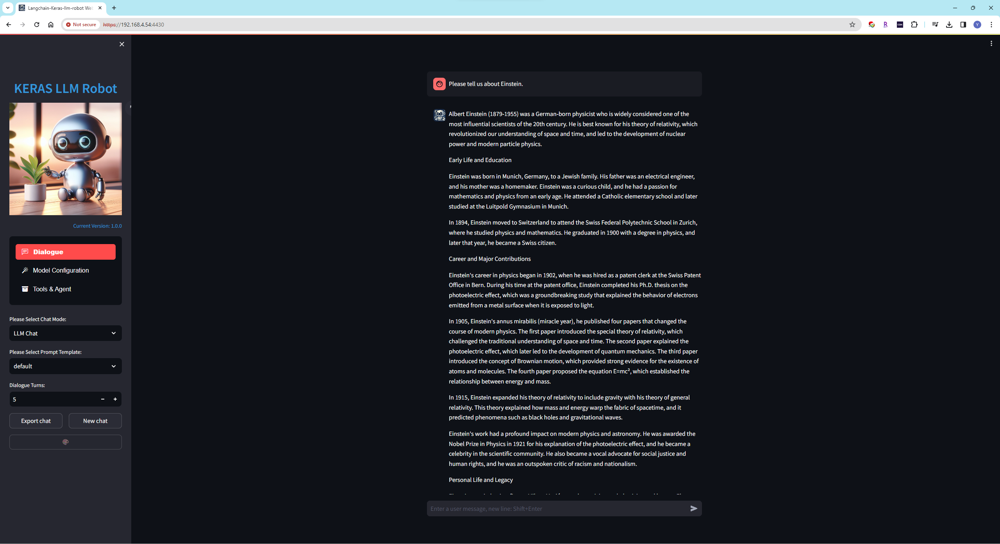
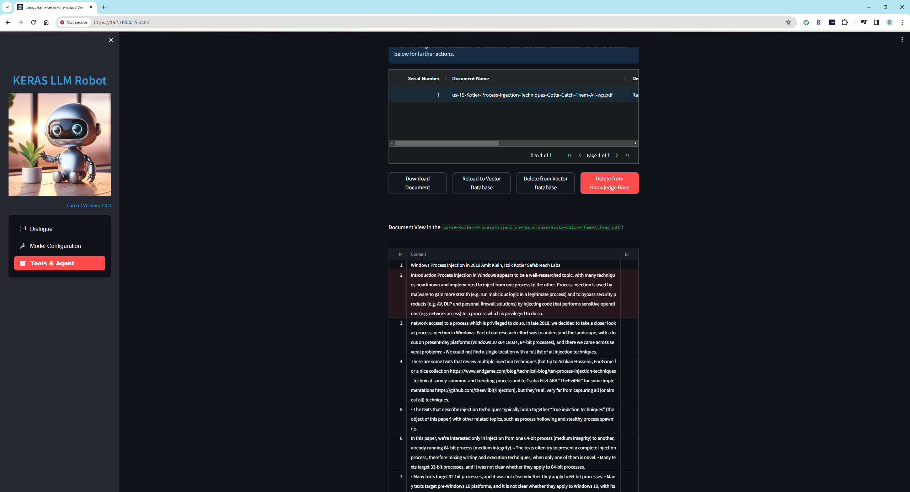
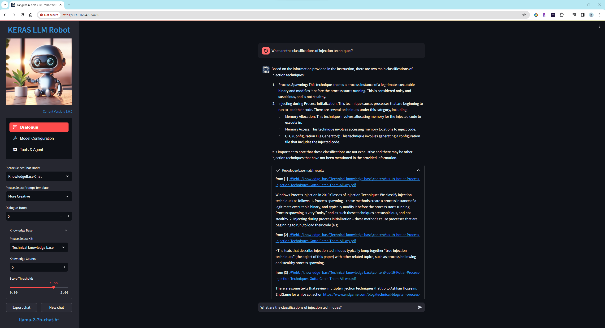

# Keras-llm-robot Web UI

🌍 [READ THIS IN ENGLISH](readme.md)

这个项目基础代码继承自 Langchain-Chatchat项目(https://github.com/chatchat-space/Langchain-Chatchat) 底层架构使用Langchain和Fastchat等开源框架，顶层使用streamlit实现。本项目完全开源，目标是可离线部署和测试Huggingface网站上的大部分开源模型，并且可以通过配置将多个模型组合起来，实现多模态，RAG，Agent等功能。项目支持Ubuntu, MacOS和Windows平台。

---

## 目录
* [快速启动](readme-cn.md#快速启动)
* [视频演示](readme-cn.md#视频演示)
* [项目介绍](readme-cn.md#项目介绍)
* [环境配置](readme-cn.md#环境配置)
* [功能介绍](readme-cn.md#功能介绍)
    * [界面介绍](readme-cn.md#界面介绍)
    * [语言模型的功能](readme-cn.md#语言模型的功能)
      * [1. 加载模型](readme-cn.md#1-加载语言模型)
      * [2. 模型量化](readme-cn.md#2-模型量化)
      * [3. 模型微调](readme-cn.md#3-模型微调)
      * [4. 提示词模版](readme-cn.md#4-提示词模版)
    * [辅助模型的功能](readme-cn.md#辅助模型的功能)
      * [1. 知识库检索](readme-cn.md#1-知识库检索)
      * [2. 代码解释器](readme-cn.md#2-代码解释器)
      * [3. 语音识别模型](readme-cn.md#3-语音识别模型)
      * [4. 图像识别模型](readme-cn.md#4-图像识别模型)
      * [5. 函数定义](readme-cn.md#5-函数定义)


## 快速启动
  
  在启动之前请先准备好运行环境，请参考 [环境配置](readme-cn.md#环境配置)

  如果仅在本地进行部署，可以使用python启动WebUI，使用http接口 http://127.0.0.1:8818
  ```bash
  python __webgui_server__.py --webui
  ```

  如果需要在云服务器上部署，并在本地访问WebUI，请使用反向代理，并以HTTPS协议启动WebUI。在本地请使用 https://127.0.0.1:4480 打开WebUI，在远端使用https接口 https://[server ip]:4480 打开WebUI。
  ```bash
  // 批处理内部默认使用的虚拟环境是 keras-llm-robot，如果想使用其它的虚拟环境名称，请自行修改批处理文件
  // windows平台
  webui-startup-windows.bat
  
  // ubuntu(linux)平台
  python __webgui_server__.py --webui
  chmod +x ./tools/ssl-proxy-linux
  ./tools/ssl-proxy-linux -from 0.0.0.0:4480 -to 127.0.0.1:8818

  // MacOS平台
  python __webgui_server__.py --webui
  chmod +x ./tools/ssl-proxy-darwin
  ./tools/ssl-proxy-darwin -from 0.0.0.0:4480 -to 127.0.0.1:8818
  ```

## 视频演示

  1. 演示使用了多模态在线模型gpt-4-vision-preview 加 Azure Speech to Text服务：

  [](https://www.youtube.com/watch?v=7VzZqgg35Ak)

  2. 对多模态模型gpt-4-vision-preview 和 Gemini-pro-vision：
   
  [](https://www.youtube.com/watch?v=yFK62Tn_f4Q)

## 项目介绍
由三个主界面组成，语言模型的聊天界面，语言模型的配置界面，辅助模型的工具和代理界面。

聊天界面如下图：

语言模型是基础模型，当它被加载之后就可以使用聊天模式。语言模型也是多模态特性中的大脑。辅助模型当中的语音，图像和向量等模型，它们的输入或者输出数据都需要语言模型来处理。语音模型可以为语言模型提供耳朵和嘴的功能，图像模型可以提供眼睛的功能，而向量模型则提供了长期记忆的功能。目前本项目支持几十种语言模型。

配置界面如下图：

可以按照需求加载你需要的语言模型，语言模型分为通用模型，多模态模型，特殊模型和在线模型。

工具和代理界面如下图：

可以按照需求加载你需要的辅助模型，辅助模型按照功能分为向量检索模型，代码执行模型，文本转语音模型，语音转文本模型，图像识别模型，图像生成模型。工具中还包括功能调用的设置(需要语言模型支持Function Calling功能)。

## 环境配置

  1. 自行安装anaconda或miniconda，以及git。windows用户还需要安装CMake工具，ubuntu用户请安装gcc
   
  2. 使用conda创建虚拟环境keras-llm-robot并安装python, python请使用3.10 或者 3.11的版本
  ```bash
  conda create -n keras-llm-robot python==3.11.5
  ```

  1. 拉取仓库
  ```bash
  git clone https://github.com/smalltong02/keras-llm-robot.git
  cd keras-llm-robot
  ```

  1. 激活虚拟环境
  ```bash
  conda activate keras-llm-robot
  ```

  1. 如果拥有NVIDIA GPU，请首先安装CUDA Toolkit (https://developer.nvidia.com/cuda-toolkit-archive) ，并在虚拟环境中安装pytorch CUDA版本 (版本号请和CUDA Toolkit版本相同 https://pytorch.org/)
  ```bash
  // 例如安装12.1版本
  conda install pytorch torchvision torchaudio pytorch-cuda=12.1 -c pytorch -c nvidia
  ```

  1. 安装依赖项, 请按照不同平台选择适当的requirements
  ```bash
  // windows平台, 安装过程中如果遇到llama-cpp-python和tts的编译错误，请将这两个安装包从requirements中删除掉，但是删除这2个包之后，将失去
  // 无法加载本地语音模型XTTS-2以及无法加载GGUF的量化模型。
  pip install -r requirements-windows.txt
  // Ubuntu平台
  pip install -r requirements-ubuntu.txt
  // MacOS平台
  pip install -r requirements-macos.txt
  ```

  1. 如果需要支持语音功能，还需要安装ffmpeg工具
  
    // windows平台

    下载ffmpeg的windows binrary包 (https://www.gyan.dev/ffmpeg/builds/).
    
    添加bin目录到系统的PATH环境变量中

    // ubuntu平台，安装 pyaudio
    sudo apt install ffmpeg
    sudo apt-get install portaudio19-dev

    // MacOS平台
    ```bash
    # libav
    brew install libav

    ####    OR    #####

    # ffmpeg
    brew install ffmpeg
    ```

  2.  如果需要从Huggingface上下载模型到本地离线运行，请自行下载模型之后，放入到"models"目录中。如果没有提前下载模型，程序会自动从Huggingface网站上下载到本地的系统缓存中。
  ```bash
  // 比如llama-2-7b-chat语言模型的目录是
  models\llm\Llama-2-7b-chat-hf

  // 比如XTTS-v2文本转语音的辅助模型目录是
  models\voices\XTTS-v2

  // 比如faster-whisper-large-v3语音转文本的辅助模型目录是
  models\voices\faster-whisper-large-v3
  ```

  8. 如果仅想在本地进行部署，可以使用python启动WebUI，http://127.0.0.1:8818
  ```bash
  python __webgui_server__.py --webui
  ```

  9. 如果需要在云服务器上部署，并在本地访问WebUI，请使用反向代理，并以HTTPS协议启动WebUI。在本地请使用https://127.0.0.1:4480 打开WebUI，在远端使用 https://[server ip]:4480 打开WebUI。
  ```bash
  // 批处理内部默认使用的虚拟环境是 keras-llm-robot，如果想使用其它的虚拟环境名称，请自行修改批处理文件
  webui-startup-windows.bat
  
  // ubuntu(linux)平台
  python __webgui_server__.py --webui
  chmod +x ./tools/ssl-proxy-linux
  ./tools/ssl-proxy-linux -from 0.0.0.0:4480 -to 127.0.0.1:8818

  // MacOS平台
  python __webgui_server__.py --webui
  chmod +x ./tools/ssl-proxy-darwin
  ./tools/ssl-proxy-darwin -from 0.0.0.0:4480 -to 127.0.0.1:8818
  ```

## 功能介绍

### 界面介绍

- #### 配置界面

    在配置界面中，可以选择合适的语言模型加载，语言模型分为`基础模型`，`多模态模型`，`特殊模型`和`在线模型`

  1. **`基础模型`** Huggingface上发布的未经量化和处理过的模型，并且它们需要支持和OpenAI相同聊天模版的模型
  2. **`多模态模型`**(`当前功能还未实现`) 在底层支持语音和文本，或者图片和文本的模型
  3. **`特殊模型`** Huggingface上发布的量化模型(GGUF)或者需要特殊聊天模版的模型
  4. **`在线模型`** 支持OpenAI和Google的在线语言模型，比如GPT4-Turbo和Gemini-Pro模型，或者在线的多模态模型GPT4-vision和Gemini-Pro-vision。需要提供OpenAI的API Key和Google API Key。可以在系统环境变量中配置OPENAI_API_KEY和GOOGLE_API_KEY，或者在配置界面中单独配置。

  `目前参数可以配置加载设备和加载位数，模型量化，模型微调，和提示词模版配置功能还未实现`


- #### 工具和代理界面

  在工具和代理界面中，可以加载辅助模型比如向量检索模型，代码执行模型，文本转语音模型，语音转文本模型，图像识别模型，图像生成模型，或者配置功能调用

  1. **`向量检索模型`** 支持本地和在线向量数据库，支持本地和在线向量模型，并且支持多种文档类型。可以为基础模型提供长期记忆力。
  2. **`代码执行模型`** (`当前功能还未实现`)
  3. **`文本转语音模型`** 支持本地模型XTTS-v2，支持Azure在线文本转语音服务，需要提供Azure的API Key。也可以在系统环境变量中配置SPEECH_KEY和SPEECH_REGION，或者在配置界面中单独配置。
  4. **`语音转文本模型`** 支持本地模型whisper，fast-whisper，支持Azure在线语音转文本服务，需要提供Azure的API Key。也可以在系统环境变量中配置SPEECH_KEY和SPEECH_REGION，或者在配置界面中单独配置。
  5. **`图像识别模型`** (`当前功能还未实现`)
  6. **`图像生成模型`** (`当前功能还未实现`)
  7. **`功能调用`** (`当前功能还未实现`)


  当语音转文本模型加载之后，在聊天界面中将会出现语音和视频聊天控件，点击`START`按钮开始通过麦克风录制语音，点击`STOP`按钮结束语音，语音模型将会自动把语音转换成文本之后和语言模型进行对话。当文本转语音模型加载之后，语言模型输出的文本会自动转换成语音并通过扬声器或耳机输出


  当多模态模型加载之后(比如Gemini-Pro-Vision)，在聊天界面中会出现上传图像和文件控件，对于上传文件的限制则根据加载的模型而定。当在聊天窗口发送文字之后，将会把上传文件和文字传送给多模态模型处理。


- ### 语言模型的功能

  1. **`加载模型`**
      
      基础模型可以使用CPU或者GPU加载，以及使用8 bits加载(`4 bits加载无效`)，当使用CPU推理输出的时候，请设置合适的CPU Threads以提高Token输出速度。当加载GPTQ模型遇到错误“Using Exllama backend requires all the modules to be on GPU.”，请在模型config.json的"quantization_config"中添加"disable_exllama": true
      
      多模态模型可以使用CPU或者GPU加载，Vision模型加载后，用户可以上传图片和文字与模型对话。Voice模型加载后，用户可以通过麦克风(无需通过辅助模型)和模型对话。`该功能还未实现`

      特殊模型可以使用CPU或者GPU加载，GGUF模型优先使用CPU设备加载。

      在线模型无需占用额外的本地资源，当前支持OpenAI和Google的在线语言模型

      ---

      **`请注意`** 当TTS库未安装，将无法加载XTTS-2本地语音模型，但仍然可以使用其它在线语音服务；llama-cpp-python库未安装，将无法加载GGUF模型；没有GPU设备，将无法加载AWQ和GPTQ模型。对于

      | 支持模型 | 类型 | 大小 |
      | :---- | :---- | :---- |
      | fastchat-t5-3b-v1.0 | LLM Model | 3B |
      | llama-2-7b-hf | LLM Model | 7B |
      | llama-2-7b-chat-hf | LLM Model | 7B |
      | chatglm2-6b | LLM Model | 7B |
      | chatglm2-6b-32k | LLM Model | 7B |
      | chatglm3-6b | LLM Model | 7B |
      | tigerbot-7b-chat | LLM Model | 7B |
      | openchat_3.5 | LLM Model | 7B |
      | Qwen-7B-Chat-Int4 | LLM Model | 7B |
      | fuyu-8b | LLM Model | 7B |
      | Yi-6B-Chat-4bits | LLM Model | 7B |
      | neural-chat-7b-v3-1 | LLM Model | 7B |
      | Mistral-7B-Instruct-v0.2 | LLM Model | 7B |
      | llama-2-13b-hf | LLM Model | 13B |
      | llama-2-13b-chat-hf | LLM Model | 13B |
      | tigerbot-13b-chat | LLM Model | 13B |
      | Qwen-14B-Chat | LLM Model | 13B |
      | Qwen-14B-Chat-Int4 | LLM Model | 13B |
      | Yi-34B-Chat-4bits | LLM Model | 34B |
      | llama-2-70b-hf | LLM Model | 70B |
      | llama-2-70b-chat-hf | LLM Model | 70B |
      | visualglm-6b| Multimodal Model (image) | 7B |
      | cogvlm-chat-hf | Multimodal Model (image) | 7B |
      | mplug-owl2-llama2-7b | Multimodal Model (image) | 7B |
      | Qwen-VL-Chat-Int4 | Multimodal Model (image) | 7B |
      | internlm-xcomposer-7b-4bit | Multimodal Model (image) | 7B |
      | phi-2-gguf | Special Model | 3B |
      | phi-2 | Special Model | 3B |
      | Yi-6B-Chat-gguf | Special Model | 7B |
      | OpenHermes-2.5-Mistral-7B | Special Model | 7B |
      | Yi-34B-Chat-gguf | Special Model | 34B |
      | Mixtral-8x7B-v0.1-gguf | Special Model | 8*7B |
      | gpt-3.5-turbo | Online Model | *B |
      | gpt-3.5-turbo-16k | Online Model | *B |
      | gpt-4 | Online Model | *B |
      | gpt-4-32k | Online Model | *B |
      | gpt-4-1106-preview | Online Model | *B |
      | gpt-4-vision-preview | Online Model | *B |
      | gemini-pro | Online Model | *B |
      | gemini-pro-vision | Online Model | *B |
      | chat-bison-001 | Online Model | *B |
      | text-bison-001 | Online Model | *B |
      | whisper-base | Voice Model | *B |
      | whisper-medium | Voice Model | *B |
      | whisper-large-v3 | Voice Model | *B |
      | faster-whisper-large-v3 | Voice Model | *B |
      | AzureVoiceService | Voice Model | *B |
      | XTTS-v2 | Speech Model | *B |
      | AzureSpeechService | Speech Model | *B |
      | OpenAISpeechService | Speech Model | *B |


  2. **`模型量化`**

      用llama.cpp等开源工具对通用模型制作2,3,4,5,6,8 bits的量化版本。`该功能还未实现`

  3. **`模型微调`**

      可以使用私有数据集，对语言模型进行微调。`该功能还未实现`

  4. **`提示词模版`**

      给语言模型设置特殊情况下的提示词模版。`该功能还未实现`
  
- ### 辅助模型的功能

  1. **`知识库检索`**

      RAG功能，需要向量数据库和向量模型，可以给语言模型提供长期记忆能力。

      目前支持以下向量数据库：

      | 向量数据库 | 类型 |
      | :---- | :---- |
      | Faiss | Local |
      | Milvus | Local |
      | PGVector | Local |
      | ElasticsearchStore | Local |
      | ZILLIZ | Online |

      可以选择以下向量模型：

      | 向量模型 | 类型 | 大小 |
      | :---- | :---- | :---- |
      | bge-small-en-v1.5 | Local | 130MB |
      | bge-base-en-v1.5 | Local | 430MB |
      | bge-large-en-v1.5 | Local | 1.3GB |
      | bge-small-zh-v1.5 | Local | 93MB |
      | bge-base-zh-v1.5 | Local | 400MB |
      | bge-large-zh-v1.5 | Local | 1.3GB |
      | m3e-small | Local | 93MB |
      | m3e-base | Local | 400MB |
      | m3e-large | Local | 1.3GB |
      | text2vec-base-chinese | Local | 400MB |
      | text2vec-bge-large-chinese | Local | 1.3GB |
      | text-embedding-ada-002 | Online | *B |
      | embedding-gecko-001 | Online | *B |
      | embedding-001 | Online | *B |

      **`请注意`** 请提前下载向量模型，并放入指定的目录中，否则无法对文档进行向量化并且放入知识库也将失败。


      支持的文档类型：

      html, mhtml, md, json, jsonl, csv, pdf, png, jpg, jpeg, bmp, eml, msg, epub, xlsx, xls, xlsd, ipynb, odt, py, rst, rtf, srt, toml, tsv, docx, doc, xml, ppt, pptx, enex, txt


      创建知识库界面：
      
      创建新知识库的时候，请输入知识库的名称和介绍，并选择合适的向量存储数据库和Embedding模型。如果知识库的文档内容是英文，推荐选择本地模型`bge-large-en-v1.5`；如果是中文为主英文为辅，推荐选择`bge-large-zh-v1.5`或者`m3e-large`

      上传文档到知识库界面：
      
      一次可以选择上传一个或多个文档，上传文档时候会对文档做内容提取，分割，向量化并添加到向量库中，时间可能会很长，请耐心等待。

      查看文档内容界面：
      
      可以检查文档切片的内容，并可以导出。将会添加修改和删除切片的功能。

      知识库聊天界面：
      
      在聊天主界面中，可以选择已经创建的知识库，基础语言模型将会根据知识库中的内容，来回答用户提问。


  2. **`代码解释器`**

      给语言模型提供代码执行功能，为大脑加上行动力。`该功能还未实现`

  3. **`语音识别模型`**

      给语言模型提供语音输入和输出功能，为大脑加上听和说的功能，支持本地模型XTTS-v2，whisper，支持Azure在线语音服务

  4. **`图像识别模型`**

      给语言模型提供图像和视频的输入和输出功能，为大脑加上眼睛和绘画能力。`该功能还未实现`

  5. **`函数定义`**

      给语言模型提供函数调用功能，为大脑加上使用工具的能力。预计支持Zapier，n8n等自动化平台。`该功能还未实现`

## 参考

Anaconda：(https://www.anaconda.com/download)

Git：(https://git-scm.com/downloads)

CMake：(https://cmake.org/download/)

Langchain项目地址：(https://github.com/langchain-ai/langchain)

Fastchat项目地址：(https://github.com/lm-sys/FastChat)