# Keras-llm-robot Web UI

🌍 [READ THIS IN CHINESE](readme-cn.md)

The project inherits from the Langchain-Chatchat project(https://github.com/chatchat-space/Langchain-Chatchat) The underlying architecture uses open-source frameworks such as Langchain and Fastchat, with the top layer implemented in Streamlit. The project is completely open-source, aiming for offline deployment and testing of most open-source models from the Hugging Face website. Additionally, it allows combining multiple models through configuration to achieve multimodal, RAG, Agent, and other functionalities.


---

## Table of Contents
* [Quick Start](readme.md#Quick-Start)
* [Video Demonstration](readme.md#Video-Demonstration)
* [Project Introduction](readme.md#Project-Introduction)
* [Environment Setup](readme.md#Environment-Setup)
* [Feature Overview](readme.md#Feature-Overview)
    * [Interface Overview](readme.md#Interface-Overview)
    * [Language Model Features](readme.md#Language-Model-Features)
      * [1. Load Model](readme.md#1-Load-Model)
      * [2. Quantization](readme.md#2-Quantization)
      * [3. Fine-tuning](readme.md#3-Fine-tuning)
      * [4. Role Play](readme.md#4-Role-Play)
    * [Auxiliary Model Features](readme.md#Auxiliary-Model-Features)
      * [1. Retrieval](readme.md#1-Retrieval)
      * [2. Code Interpreter](readme.md#2-Code-Interpreter)
      * [3. Speech Recognition](readme.md#3-Speech-Recognition)
      * [4. Image Recognition](readme.md#4-Image-Recognition)
      * [5. Network Search Engine](readme-cn.md#5-Network-Search-Engine)
      * [6. Function Calling](readme.md#6-Function-Calling)


## New Feature Updates

- 🚀 Update Log for 2024-05-13
  1. Support for gpt-4o of OpenAI
  2. Support for Yi-1.5-6B-Chat and Yi-1.5-9B-Chat
  3. Support for "Intelligent Customer Support"

- 🚀 Update Log for 2024-05-01
  1. Fix issue for GGUF model.
  2. Support for Llama3-8B-Chinese-Chat.

- 🚀 Update Log for 2024-04-28
  1. Support for Function Calling feature.
  2. Updated Keras LLM Interpreter.

- 🚀 Update Log for 2024-04-19
  1. Support for models Meta-Llama-3-8B and Meta-Llama-3-8B-Instruct.
  2. Introduced a new feature called "Role-Playing," enabling offline or online models to take on different roles. For example, you can have the LLM Model role-play as an "English Translator," "Interviewer," "Novelist," "Product Manager," "Yogi" and more, thereby providing more specialized responses.

- 🚀 Update Log for 2024-04-15
  1. Support for models Orion-14B-Chat, Orion-14B-LongChat and Orion-14B-Chat-Int4. To correctly load the model and perform inference, please install the `flash-attn` library (currently supported only on Linux and Windows).
  ```bash
  # download URL for linux:
  https://github.com/Dao-AILab/flash-attention/releases

  # download URL for Windows:
  https://github.com/bdashore3/flash-attention/releases

  # install command:
  pip install *.whl
  ```

- 🚀 Update Log for 2024-04-14
  1. Support for the keras-llm-interpreter code interpreter, compatible with Windows, macOS, and Ubuntu operating systems. Provides locally executable binaries and Docker images for running in a sandbox environment.
  2. Support for models Qwen1.5-4B-Chat and Qwen1.5-7B-Chat.
   
- 🚀 Update Log for 2024-02-14
  1. Support for the open-interpreter code interpreter.
  2. Support for models gemma-2b and gemma-7b.


## Quick Start
  
  Please first prepare the runtime environment, refer to [Environment Setup](readme.md#Environment-Setup)

  If deploying locally, you can start the Web UI using Python with an HTTP interface at http://127.0.0.1:8818
  ```bash
  python __webgui_server__.py --webui
  ```

  If deploying on a cloud server and accessing the Web UI locally, Please use reverse proxy and start the Web UI with HTTPS. Access using https://127.0.0.1:4480 on locally, and use the https interface at https://[server ip]:4480 on remotely:
  ```bash
  // By default, the batch file uses the virtual environment named keras-llm-robot,
  // Modify the batch file if using a different virtual environment name.

  // windows platform
  webui-startup-windows.bat

  // ubuntu(linux) platform
  python __webgui_server__.py --webui
  chmod +x ./tools/ssl-proxy-linux
  ./tools/ssl-proxy-linux -from 0.0.0.0:4480 -to 127.0.0.1:8818

  // MacOS platform
  python __webgui_server__.py --webui
  chmod +x ./tools/ssl-proxy-darwin
  ./tools/ssl-proxy-darwin -from 0.0.0.0:4480 -to 127.0.0.1:8818
  ```

  As an example with Ubuntu, You can access the Server from other PCs on the local network after starting the reverse proxy with ssl-proxy-darwin:

  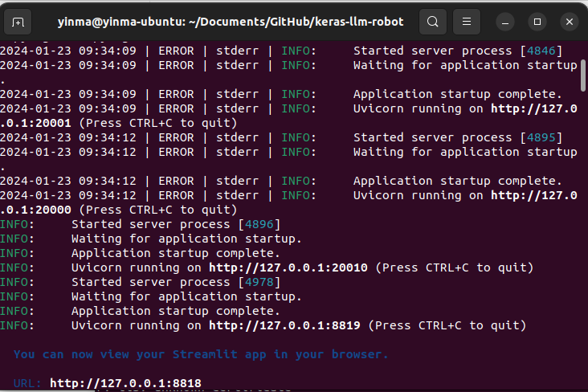
  
  Start Server on Ubuntu.

  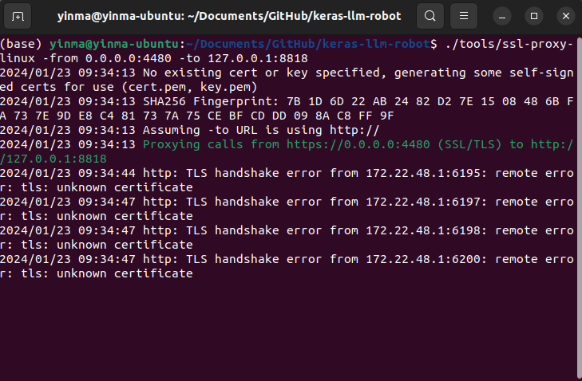
  
  Start Reverse Proxy on Ubuntu.

  
  
  Access Server on Windows PC by https service.

## Feature Demonstration

  1. The demonstration Llama-3-8B + Keras Code Interpreter:

  [](https://youtu.be/as__vi8rmDc)

  2. The demonstration Phi-3-mini + Keras Code Interpreter:

  [](https://youtu.be/KbHqw7JnG6s)

  3. The demonstration Llama-3-8B + Function Calling:

  [](https://youtu.be/pTthwsNhGok)

  4. The demonstration Phi-3-mini + Function Calling:

  [](https://youtu.be/YubzzFBhxas)

  5. The demonstration utilizes a multimodal online model GPT-4-vision-preview along with Azure Speech to Text services:

  [](https://www.youtube.com/watch?v=7VzZqgg35Ak)

  6. The demonstration gpt-4-vision-preview VS Gemini-pro-vision：
   
  [](https://www.youtube.com/watch?v=yFK62Tn_f4Q)

  7. The demonstration of the Retrieval Augmented Generation (RAG) feature：
  
  [](https://www.youtube.com/watch?v=dyIFLISlskI) 

  8. Demonstration of Image Recognition and Image Generation Features：
  
  Presentation of text to image, translating natural language into the CLIP for image generation models:

  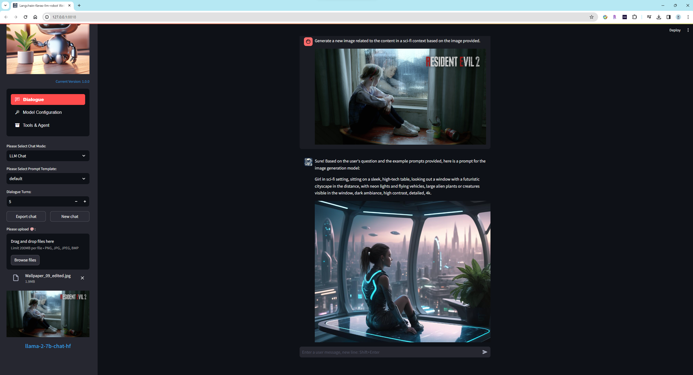 | 

  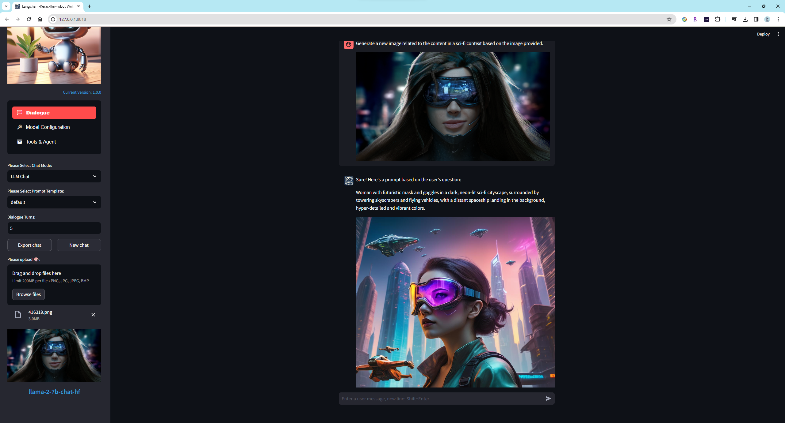 | 

  Creating Handicrafts Based on Items in the Picture:

  


## Project Introduction
Consists of three main interfaces: the chat interface for language models, the configuration interface for language models, and the tools and agent interface for auxiliary models.

Chat Interface:

The language model is the foundation model that can be used in chat mode after loading. It also serves as the brain in multimodal features. Auxiliary models, such as voice, image, and retrieval models, require language models to process their input or output text. The voice model like to ear and mouth, the image model like to eye, and the retrieval model provides long-term memory. The project currently supports dozens of language models.

Configuration Interface:

Models can be loaded based on requirements, categorized into general, multimodal, special, and online models.

Tools & Agent Interface：

Auxiliary models, such as retrieval, code execution, text-to-speech, speech-to-text, image recognition, and image generation, it can be loaded based on requirements. The tools section includes settings for function calls (requires language model support for function calling).

## Environment Setup

  1. Install Anaconda or Miniconda and Git. Windows users also need to install the CMake tool, Ubuntu users need to install gcc tools.

  ```bash
  // In a clean environment on Ubuntu, follow the steps below to pre-install the packages:
  // install gcc
    sudo apt update
    sudo apt install build-essential

  // install for ffmpeg
    sudo apt install ffmpeg

  // install for pyaudio
    sudo apt-get install portaudio19-dev

  // The default installation of requestment is for the faiss-cpu. If you need to install the faiss-gpu
    pip3 install faiss-gpu
  ```
   
  2. Create a virtual environment named keras-llm-robot using conda and install Python of 3.10 or 3.11:
  ```bash
  conda create -n keras-llm-robot python==3.11.5
  ```

  3. Clone the repository:
  ```bash
  git clone https://github.com/smalltong02/keras-llm-robot.git
  cd keras-llm-robot
  ```

  4. Activate the virtual environment:
  ```bash
  conda activate keras-llm-robot
  ```

  5. If you have an NVIDIA GPU, Please install the CUDA Toolkit from (https://developer.nvidia.com/cuda-toolkit-archive), and install the PyTorch CUDA version in the virtual environment (same to the CUDA Toolkit version https://pytorch.org/):
  ```bash
  // such as install version 12.1
  conda install pytorch=2.1.2 torchvision=0.16.2 torchaudio=2.1.2 pytorch-cuda=12.1 -c pytorch -c nvidia
  ```

  6. Install dependencies, Please choose the appropriate requirements file based on your platform, On the Windows, if encounter compilation errors for llama-cpp-python or tts during the installation, please remove these two packages from the requirements:
  ```bash
  // windows
  pip install -r requirements-windows.txt
  // Ubuntu
  pip install -r requirements-ubuntu.txt
  // MacOS
  pip install -r requirements-macos.txt
  ```

  7. If speech feature is required, you also need to install the ffmpeg tool.

    // For Windows:
    Download the Windows binary package of ffmpeg from (https://www.gyan.dev/ffmpeg/builds/).
    Add the bin directory to the system PATH environment variable.

    // for ubuntu, install ffmpeg and pyaudio
    sudo apt install ffmpeg
    sudo apt-get install portaudio19-dev

    // For MacOS
    ```bash
    # Using libav
    brew install libav

    ####    OR    #####

    # Using ffmpeg
    brew install ffmpeg
    ```

  8. If you need to download models from Hugging Face for offline execution, please download the models yourself and place them in the "models" directory. If the models have not been downloaded in advance, the WebUI will automatically download them from the Hugging Face website to the local system cache.
  ```bash
  // such as the folder of llama-2-7b-chat model:
  models\llm\Llama-2-7b-chat-hf

  // such as the folder of XTTS-v2 speech-to-text model:
  models\voices\XTTS-v2

  // such as the folder of faster-whisper-large-v3 text-to-speech model:
  models\voices\faster-whisper-large-v3
  ```

  9. When using the `OpenDalleV1.1` model to generate images, if using 16-bit precision, please download the `sdxl-vae-fp16-fix` model from Huggingface and place it in the `models\imagegeneration` folder. If enabling the Refiner, please download the `stable-diffusion-xl-refiner-1.0` model from Huggingface and place it in the `models\imagegeneration` folder beforehand.
 
  10. When using the Model `stable-video-diffusion-img2vid` and `stable-video-diffusion-img2vid-xt`, it is necessary to install ffmpeg and the corresponding dependencies first:

        ```bash
        1. download generative-models from https://github.com/Stability-AI/generative-models in project root folder.
        2. cd generative-models & pip install .
        3. pip install pytorch-lightning
           pip install kornia
           pip install open_clip_torch
        ```

  11.  If run locally, start the Web UI using Python at http://127.0.0.1:8818:
  ```bash
  python __webgui_server__.py --webui
  ```

  12.  If deploying on a cloud server and accessing the Web UI locally, use reverse proxy and start the Web UI with HTTPS. Access using https://127.0.0.1:4480 on locally, and use the https interface at https://[server ip]:4480 on remotely:
  ```bash
  // By default, the batch file uses the virtual environment named keras-llm-robot,
  // Modify the batch file if using a different virtual environment name.

  webui-startup-windows.bat
  
  // ubuntu(linux)平台

  python __webgui_server__.py --webui
  chmod +x ./tools/ssl-proxy-linux
  ./tools/ssl-proxy-linux -from 0.0.0.0:4480 -to 127.0.0.1:8818

  // MacOS平台

  python __webgui_server__.py --webui
  chmod +x ./tools/ssl-proxy-darwin
  ./tools/ssl-proxy-darwin -from 0.0.0.0:4480 -to 127.0.0.1:8818
  ```

## Feature Overview

### Interface Overview

- #### Configuration Interface

    In the configuration interface, you can choose suitable language models to load, categorized as `Foundation Models`, `Multimodal Models`, `Special Models`, and `Online Models`.

  1. **`Foundation Models`** Untouched models published on Hugging Face, supporting models with chat templates similar to OpenAI.
  2. **`Multimodal Models`** Models supporting both voice and text or image and text at the lower level.
  3. **`Code Models`** Code generation model.
  4. **`Special Models`** Quantized models (GGUF) published on Hugging Face or models requiring special chat templates.
  5. **`Online Models`** Supports online language models from OpenAI and Google, such as GPT4-Turbo, Gemini-Pro, GPT4-vision, and Gemini-Pro-vision. Requires OpenAI API Key and Google API Key, which can be configured in the system environment variables or in the configuration interface.


- #### Tools & Agent Interface

  In the tools & agent interface, you can load auxiliary models such as retrieval, code execution, text-to-speech, speech-to-text, image recognition, image generation, or function calling.

  1. **`Retrieval`** Supports both local and online vector databases, local and online embedding models, and various document types. Can provide long-term memory for the Foundation model.
  2. **`Code Interpreter`** Supports local interpreter "keras-llm-interpreter".
  3. **`Text-to-Speech`** Supports local model XTTS-v2 and Azure online text-to-speech service. Requires Azure API Key, which can be configured in the system environment variables `SPEECH_KEY` and `SPEECH_REGION`, or in the configuration interface.
  4. **`Speech-to-Text`** Supports local models whisper and fast-whisper and Azure online speech-to-text service. Requires Azure API Key, which can be configured in the system environment variables `SPEECH_KEY` and `SPEECH_REGION`, or in the configuration interface.
  5. **`Image Recognition`** Supports local model blip-image-captioning-large.
  6. **`Image Generation`** Supports local model OpenDalleV1.1 for static image generation and local model stable-video-diffusion-img2vid-xt for dynamic image generation.
  7. **`Function Calling`** You can configure function calling to empower models with the ability to use utilities.


  Once the speech-to-text model is loaded, voice and video chat controls will appear in the chat interface. Click the `START` button to record voice via the microphone and the `STOP` button to end the voice recording. The speech model will automatically convert the speech to text and engage in conversation with the language model. When the text-to-speech model is loaded, the text output by the language model will automatically be converted to speech and output through speakers and headphones.


  Once the Multimodal model is loaded(such as Gemini-Pro-Vision)，upload controls will appear in the chat interface, The restrictions on uploading files depend on the loaded model. After sending text in the chatbox, both uploaded files and text will be forwarded to the multimodal model for processing.


- ### Language Model Features

  1. **`Load Model`**
      
      **Foundation Models** can be loaded with CPU or GPU, and with 8-bits loading (`4-bits is invalid`). Set the appropriate CPU Threads to improve token output speed when using CPU. When encountering the error 'Using Exllama backend requires all the modules to be on GPU' while loading the GPTQ model, please add "'disable_exllama': true" in the 'quantization_config' section of the model's config.json.
      
      **Multimodal models** can be loaded with CPU or GPU. For Vision models, users can upload images and text for model interaction. For Voice models, users can interact with the model using a microphone (without the need for auxiliary models). (`Not implemented`)

      **Special models** can be loaded with CPU or GPU, Please prioritize CPU loading of GGUF models.

      **Online models** do not require additional local resources and currently support online language models from OpenAI and Google.


      **`NOTE`** When the TTS library is not installed, XTTS-2 local speech models cannot be loaded, but other online speech services can still be used. If the llama-cpp-python library is not installed, the GGUF model cannot be loaded. Without a GPU device, AWQ and GPTQ models cannot be loaded.

      | Supported Models | Model Type | Size |
      | :---- | :---- | :---- |
      | fastchat-t5-3b-v1.0 | LLM Model | 3B |
      | llama-2-7b-hf | LLM Model | 7B |
      | llama-2-7b-chat-hf | LLM Model | 7B |
      | chatglm2-6b | LLM Model | 7B |
      | chatglm2-6b-32k | LLM Model | 7B |
      | chatglm3-6b | LLM Model | 7B |
      | tigerbot-7b-chat | LLM Model | 7B |
      | openchat_3.5 | LLM Model | 7B |
      | Qwen-7B-Chat-Int4 | LLM Model | 7B |
      | fuyu-8b | LLM Model | 7B |
      | Yi-6B-Chat-4bits | LLM Model | 7B |
      | neural-chat-7b-v3-1 | LLM Model | 7B |
      | Mistral-7B-Instruct-v0.2 | LLM Model | 7B |
      | llama-2-13b-hf | LLM Model | 13B |
      | llama-2-13b-chat-hf | LLM Model | 13B |
      | tigerbot-13b-chat | LLM Model | 13B |
      | Qwen-14B-Chat | LLM Model | 13B |
      | Qwen-14B-Chat-Int4 | LLM Model | 13B |
      | Yi-34B-Chat-4bits | LLM Model | 34B |
      | llama-2-70b-hf | LLM Model | 70B |
      | llama-2-70b-chat-hf | LLM Model | 70B |
      | cogvlm-chat-hf | Multimodal Model (image) | 7B |
      | Qwen-VL-Chat | Multimodal Model (image) | 7B |
      | Qwen-VL-Chat-Int4 | Multimodal Model (image) | 7B |
      | stable-video-diffusion-img2vid | Multimodal Model (image) | 7B |
      | stable-video-diffusion-img2vid-xt | Multimodal Model (image) | 7B |
      | Qwen-Audio-Chat | Multimodal Model (image) | 7B |
      | phi-2-gguf | Special Model | 3B |
      | phi-2 | Special Model | 3B |
      | Yi-6B-Chat-gguf | Special Model | 7B |
      | OpenHermes-2.5-Mistral-7B | Special Model | 7B |
      | Yi-34B-Chat-gguf | Special Model | 34B |
      | Mixtral-8x7B-v0.1-gguf | Special Model | 8*7B |
      | gpt-3.5-turbo | Online Model | *B |
      | gpt-3.5-turbo-16k | Online Model | *B |
      | gpt-4 | Online Model | *B |
      | gpt-4-32k | Online Model | *B |
      | gpt-4-1106-preview | Online Model | *B |
      | gpt-4-vision-preview | Online Model | *B |
      | gemini-pro | Online Model | *B |
      | gemini-pro-vision | Online Model | *B |
      | chat-bison-001 | Online Model | *B |
      | text-bison-001 | Online Model | *B |
      | whisper-base | Voice Model | *B |
      | whisper-medium | Voice Model | *B |
      | whisper-large-v3 | Voice Model | *B |
      | faster-whisper-large-v3 | Voice Model | *B |
      | AzureVoiceService | Voice Model | *B |
      | XTTS-v2 | Speech Model | *B |
      | AzureSpeechService | Speech Model | *B |
      | OpenAISpeechService | Speech Model | *B |

      `Notes for Multimodal Models`

      - The Model `cogvlm-chat-hf`, `Qwen-VL-Chat`, and `Qwen-VL-Chat-Int4` support single-image file input with text input, capable of recognizing image content and answering questions about the image based on natural language.

      - The Model `stable-video-diffusion-img2vid` and `stable-video-diffusion-img2vid-xt` support single-image file input and generate video based on the image.

        When using these two models, it is necessary to install ffmpeg and the corresponding dependencies first:

        ```bash
        1. download generative-models from https://github.com/Stability-AI/generative-models in project root folder.
        2. cd generative-models & pip install .
        3. pip install pytorch-lightning
           pip install kornia
           pip install open_clip_torch
        ```

      - The Model `Qwen-Audio-Chat` supports single audio file input with text input and provides responses to the content of the audio file based on natural language.

  2. **`Quantization`**

      Use open-source tools like llama.cpp to create quantized versions of general models with 2, 3, 4, 5, 6, and 8 bits. `Not implemented`

  3. **`Fine-tuning`**

      You can fine-tune the language model using a private dataset. `Not implemented`

  4. **`Role Play`**

      You can have offline or online LLM Models play different roles to provide more professional responses.

      Support english and chinese roles.

      Currently supported roles include:

      | Role |
      | :---- |
      |English Translator|
      |Interviewer|
      |Spoken English Teacher|
      |Travel Guide|
      |Advertiser|
      |Storyteller|
      |Stand-up Comedian|
      |Debater|
      |Screenwriter|
      |Novelist|
      |Movie Critic|
      |Poet|
      |Rapper|
      |Motivational Speaker|
      |Math Teacher|
      |Career Counselor|
      |Doctor|
      |Dentist|
      |Chef|
      |Automobile Mechanic|
      |Text Based Adventure Game|
      |Fancy Title Generator|
      |Yogi|
      |Essay Writer|
      |Food Critic|
      |Machine Learning Engineer|
      |Regex Generator|
      |Startup Idea Generator|
      |Product Manager|

  
- ### Auxiliary Model Features

  1. **`Retrieval`**

      RAG functionality requires a vector database and embedding models to provide long-term memory capabilities to the language model. 

      Support the following Vector Database:

      | Databases | Type |
      | :---- | :---- |
      | Faiss | Local |
      | Milvus | Local |
      | PGVector | Local |
      | ElasticsearchStore | Local |
      | ZILLIZ | Online |

      Support the following Embedding Models:

      | Model | Type | Size |
      | :---- | :---- | :---- |
      | bge-small-en-v1.5 | Local | 130MB |
      | bge-base-en-v1.5 | Local | 430MB |
      | bge-large-en-v1.5 | Local | 1.3GB |
      | bge-small-zh-v1.5 | Local | 93MB |
      | bge-base-zh-v1.5 | Local | 400MB |
      | bge-large-zh-v1.5 | Local | 1.3GB |
      | m3e-small | Local | 93MB |
      | m3e-base | Local | 400MB |
      | m3e-large | Local | 1.3GB |
      | text2vec-base-chinese | Local | 400MB |
      | text2vec-bge-large-chinese | Local | 1.3GB |
      | text-embedding-ada-002 | Online | *B |
      | embedding-gecko-001 | Online | *B |
      | embedding-001 | Online | *B |

      **`NOTE`** Please download the embedding model in advance and place it in the specified folder, otherwise the document vectorization will not be possible, and uploading to the knowledge base will also fail.

      **`NOTE`** When using the Milvus database, it is recommended to deploy it locally or on a Kubernetes (k8s) cluster using Docker. Please refer to the official Milvus documentation and download the docker file at https://github.com/milvus-io/milvus/releases/download/v2.3.0/milvus-standalone-docker-compose.yml .

      ```bash
        1. please rename it to docker-compose.yml When download was finished.

        2. Create local folder for Milvus and copy the file docker-compose.yml into it.

        3. create sub folder conf, db, logs, pic, volumes, wal

        4. Execute the command in that folder
           docker-compose up -d

        5. Please check whether the image deployment is successful in the Docker interface. and ensure that the image is running and listening on ports 19530 and 9091.
      ```

      **`NOTE`** When using the PGVector database，it is recommended to deploy it locally using Docker.
      ```bash
        1. Execute the command for download image.
           docker pull ankane/pgvector

        2. Deploy the container using the following command, and modify the DB name, username, and password as needed. (Please also update the 'connection_uri' configuration in kbconfig.json under 'pg').
           docker run --name pgvector -e POSTGRES_DB=keras-llm-robot -e POSTGRES_USER=postgres -e POSTGRES_PASSWORD=postgres -p 5432:5432 -d ankane/pgvector

        3. Please check whether the image deployment is successful in the Docker interface. and ensure that the image is running and listening on ports 5432.
      ```

      As an example with Ubuntu, after successfully launching the server-side of Milvus and PGVector, you can check them in Docker Desktop. Additionally, you can install clients such as attu or pgAdmin to manage vector DB:

      


      Support the following Documents:

      html, mhtml, md, json, jsonl, csv, pdf, png, jpg, jpeg, bmp, eml, msg, epub, xlsx, xls, xlsd, ipynb, odt, py, rst, rtf, srt, toml, tsv, docx, doc, xml, ppt, pptx, enex, txt

      Knowledge Base Interface:
      
      When creating a new knowledge base, please enter the name and introduction of the knowledge base, and select an appropriate vector database and embedding model. If the document content of the knowledge base is in English, it is recommended to choose the local model `bge-large-en-v1.5`; if the content is predominantly in Chinese with some English, it is recommended to choose `bge-large-zh-v1.5` or `m3e-large`.

      Upload Documents Interface:
      
      You can choose to upload one or multiple documents at a time. During the document upload, content extraction, split, vectorization, and addition to the vector database will be performed. The process may take a considerable amount of time, so please be patient.

      Documents Content Interface:
      
      You can inspect the content of document slices and export them.

      Knowledge Base Chat Interface:
      
      In the chat interface, you can select a knowledge base, and the Foundation model will answer user queries based on the content within the selected knowledge base.


  2. **`Code Interpreter`**

      Enable code execution capability for the language model to empower it with actionable functionality for the mind.

      Keras-llm-interpreter provides two modes for usage: the first is the local execution mode, which runs code on the local PC, allowing modifications to the local PC environment; the second is the Docker image mode, providing a more secure execution environment as it operates within a sandbox, ensuring that running code does not affect the local PC environment.

      (1) Local Execution Mode

      First, configure the local execution environment:
      ```bash
        pip install ipykernel
        pip install ipython

        python -m ipykernel install --name "python3" --user
      ```

      (2) Docker Image Mode

      Downloading the Docker image:
      ```bash
        1. Execute the command to download the image:
           docker pull smalltong02/keras-interpreter-terminal

        2. Deploy the container using the following command, adjusting the port as needed:
           docker run -d -p 20020:20020 smalltong02/keras-interpreter-terminal

        3. Check in the Docker interface to ensure that the image deployment was successful, ensure that the image is running, and listening on port 20020.
      ```

      (3) Enable the code interpreter and run a task demonstration:

      Enable the code interpreter feature:
      

      Load model Meta-Llama-3-8B-Instruct，Plot Tesla and Apple stock price YTD from 2024:
      
      

      Use Python language to draw an image of a pink pig and display it:
      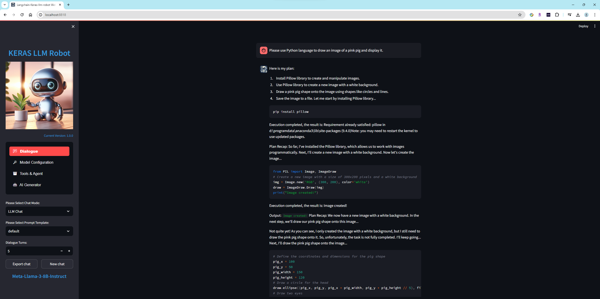
      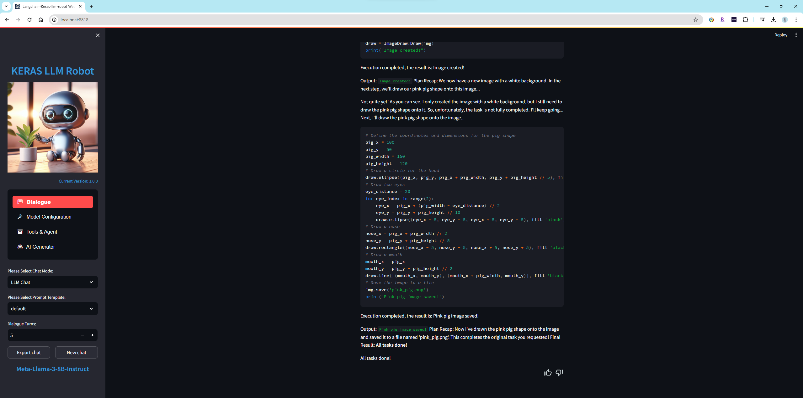
      


      create a word cloud image based on the file "wordcloud.txt" and display it:
      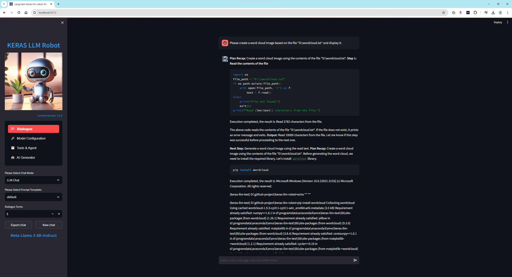
      


  3. **`Speech Recognition and Generation`**

      Provide the language model with speech input and output capabilities, adding the functions of listening and speaking to the mind. Support local models such as XTTS-v2 and Whisper, as well as integration with Azure online speech services.

  4. **`Image Recognition and Generation`**

      Provide the language model with input and output capabilities for images and videos, adding the functions of sight and drawing to the mind. 

      Support the following Image:

      png, jpg, jpeg, bmp

      | Model | Type | Size |
      | :---- | :---- | :---- |
      | blip-image-captioning-large | Image Recognition Model | *B |
      | OpenDalleV1.1 | Image Generation Model | *B |

      When using the `OpenDalleV1.1` model to generate images, if using 16-bit precision, please download the `sdxl-vae-fp16-fix` model from Huggingface and place it in the `models\imagegeneration` folder. If enabling the Refiner, please download the `stable-diffusion-xl-refiner-1.0` model from Huggingface and place it in the `models\imagegeneration` folder beforehand.

      Image Recognition:
      
      

      Static image generation:

      
      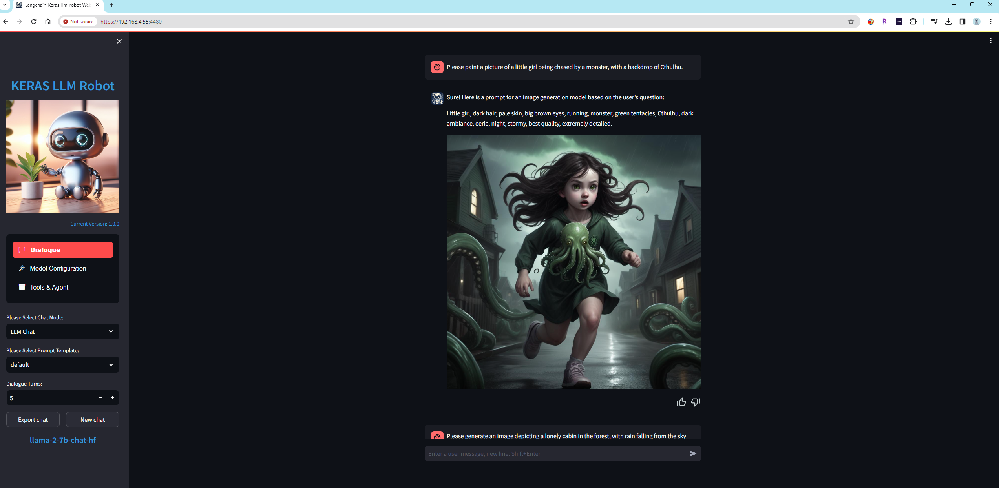
      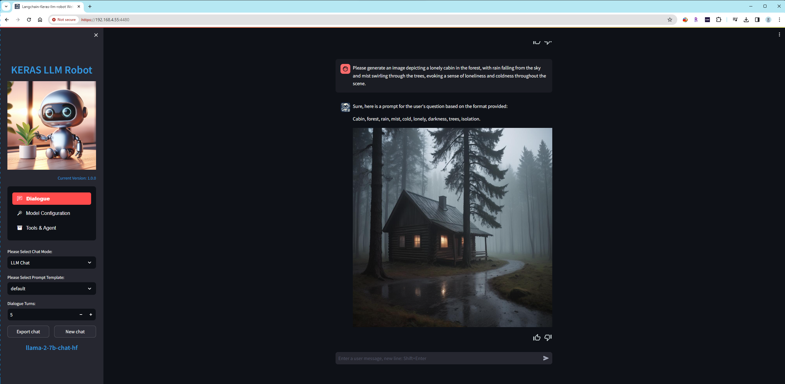
      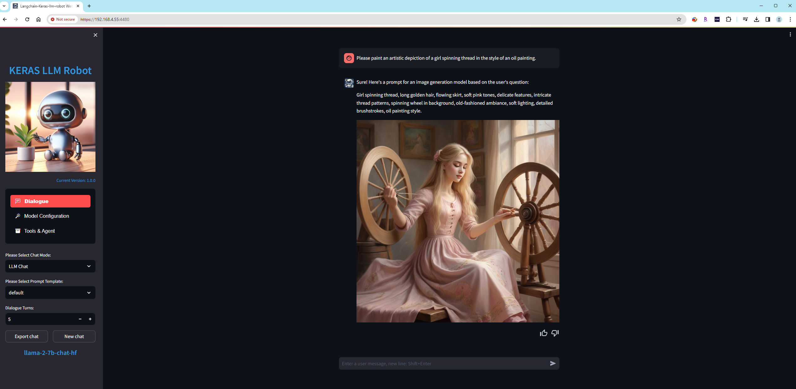

      Dynamic image generation:

      
      
  5. **`Network Search Engine`**

      Providing language models with network retrieval capabilities adds the ability for the brain to retrieve the latest knowledge from the internet.

      Support the following Network Search Engine：

      | Network Search Engine | Key |
      | :---- | :---- |
      | duckduckgo | No |
      | bing | Yes |
      | metaphor | Yes |

      When use `bing` and `metaphor` search engine，Please apply and config API Key first.

      Please install the following packages before using the network search engine.
      ```bash
        1. pip install duckduckgo-search
        2. pip install exa-py
        3. pip install markdownify
        4. pip install strsimpy
      ```

      **`Support smart feature, The smart feature allows the model to autonomously decide whether to use a search engine when answering questions`**

  6. **`Function Calling`**

      Provide the language model with function calling capability, empowering the mind with the ability to use tools.

      Add two function，get_current_time() return current time；get_current_location() return current location.

      Enable Function Calling Feature:

      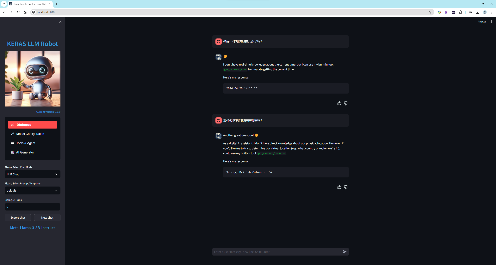

      Disable Function Calling feature:

      

## Note

Anaconda download：(https://www.anaconda.com/download)

Git download：(https://git-scm.com/downloads)

CMake download：(https://cmake.org/download/)

Langchain Project: (https://github.com/langchain-ai/langchain)

Fastchat Project: (https://github.com/lm-sys/FastChat)